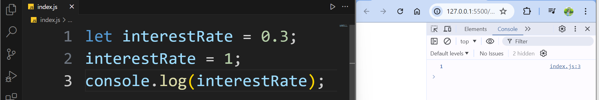
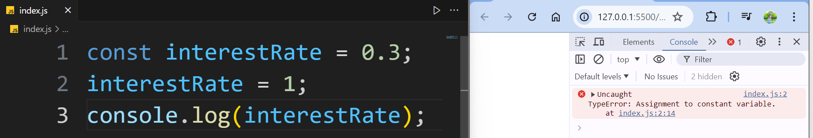

# Constants

- Alright now let's declare a variable called interest rate

```js
let interestRate = 0.3;
```

- Now this is the initial value, we can always change that later, so, we can set interest rate to let's say 1

```js
let interestRate = 0.3;
interestRate = 1;
```

- Now if you log this on the console, of course we're going to see the new value, right? So save the changes, and here's one on the console.



- However, on a real world application, there are situations that we don't want the value of a variable to change.

- Because otherwise it's going to create all kinds of bugs in our application.

- In those situations, instead of a variable, we use a **constant**.

> Remember that the value of a variable as the name implies, can change, but the value of a constant cannot change.

**Syntax**:

- So here, if we change `let` to `const`. Now `interestRate` will be constant.

```js
const interestRate = 0.3;
interestRate = 1;
```

- So, when I save the changes, we're going to see an error, in the console on line 2, where we reassign `interestRate`.



- So we cannot reassign a constant or change the value of the constant variable.

- The best practice is that if you are not going to reassign the value to variable then you should you constant variable (`const` keyword) and that should be the default choice. Otherwise, use variable (`let` keyword).

