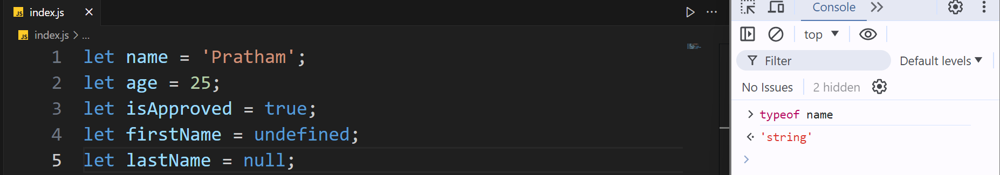
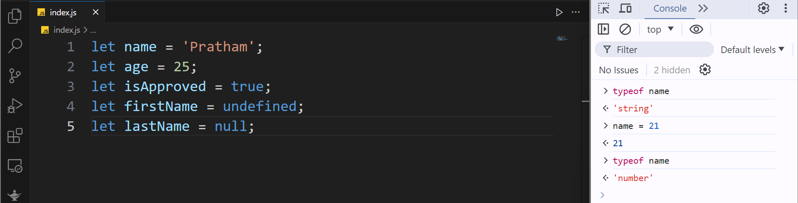
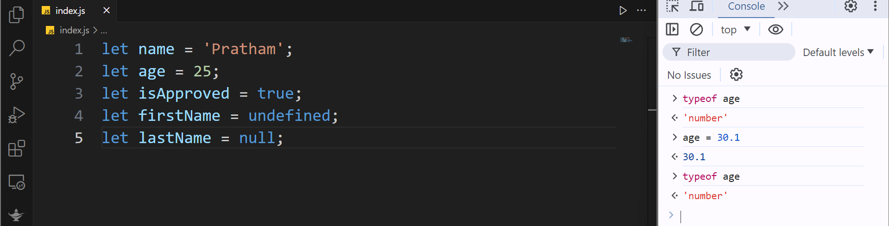
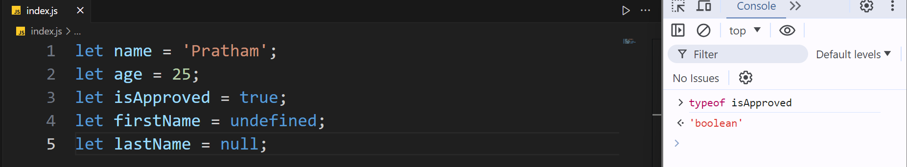
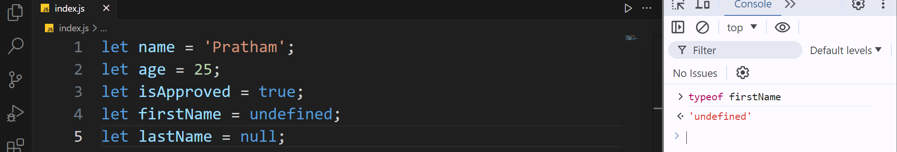
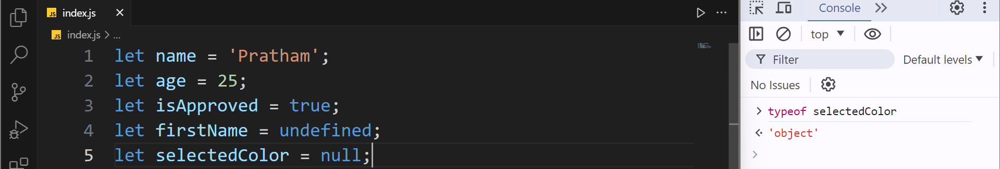

## Dynamic Typing

- One thing that separates JavaScript from a lot of programming languages, is that JavaScript is a dynamic language.

**What do I mean by dynamic?**

- Well, we have two types of programming languages:
  
  - Static languages or
  
  - Dynamic languages

- In static languages, when we declare a variable, the type of the variable is set and it cannot be changed in the future.

```cpp
string name = "John";
```

- In a dynamic language like JavaScript, the type of a variable can change at run time.

```js
let name = 'John';
```

**Let's see this in code:**

```js
let name = 'Pratham'; 
let age = 25; 
let isApproved = true; 
let firstName = undefined; 
let selectedColor = null;
```

- So back in the example from the last lecture we have declared this name variable, and we have set that to a string, so the type of name is currently a string, but it can change in the future.

- Let us take a look in console, we can execute some JavaScript code here, we have:

```js
typeof
```

- we have this type of operator, and with that we can check the type of a variable.

> typeof operator is used to check the data-type of the variable in JavaScript



- So after that we add the name of the variable after the `typeof` operator. In this case the `name` variable is string.

- If you reassign name to a different value, like a number, and check it's type:



- Observe that the type is now changed to a number, this is what we call a dynamic language (unlike static languages the type of these variables will be determined at runtime based on the values that we assigned to them).

- Now, let's take a look at a few more examples of the `typeof` operator.

> to clear the console, type command : `ctrl` + `L` 

- So now let's take a look at the type of age,



- Now if we change age to a floating point number, and I know it doesn't make sense, but let's just stick to this for example, 30.1, and then look at type of age, it's still a number.

> In JavaScript, unlike other programming languages we don't have two kinds of numbers, like integer or floating point number. All numbers are of type number.

- Now, let's look at the type of is approved, it's a boolean as I told you before.



- what about the first name, let's have a look:



It's undefined, and that's funny, because the value of this variable is undefined, but it's type is undefined as well. What does this mean??

- Well, earlier I told you that we had two categories of types, we have:
  
  - primitives or value types, and
  
  - Reference types

- In the primitive types category, we have strings, numbers, booleans, undefined and null. So **undefined** is actually a **type**, but it's also a **value**.

- In this example, because we have set first name, to undefined as a value it's type is also undefined, But what about selected color??

- Let's have a look:



- The type of this variable is an **object**.

What is an object? That's a topic for the next lecture.