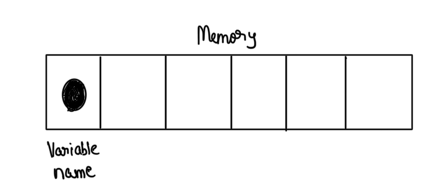
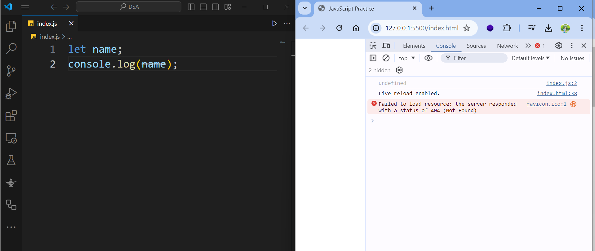
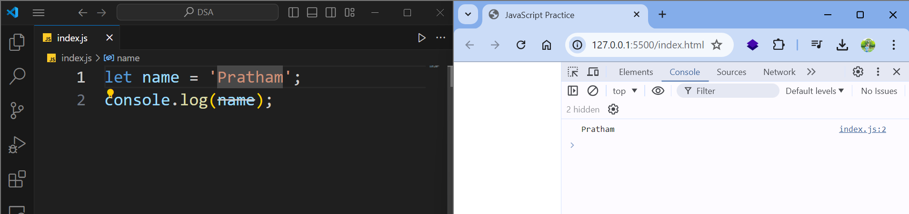

## Variables

- Let's start this section by a discussion of variables, which are one of the most fundamental concepts in JavaScript and any other programming languages.

> In programming, we use a variable to store data temporarily in the computers memory.

- So we store our data somewhere, and give that memory location a name.

- And with this name, we can read the data at the given location in the future



- Here's a metaphor for better example: 
  
  - Think of the boxes you use to organize your stuff. 
  
  - You put your stuff in various boxes, and put a label on each box. 
  
  - With this, you can easily find your stuff. A variable is like a box.
  
  

- What we put inside the box, is the value that we assign to a variable, that's the data, and the label that we put on the box is the name of our variable.

Now let's see this in code:

- So here in `index.js`, I'm going to declare a variable.

- Previously in the old days, before ES6, we used the `var` keyword to declare a variable. But there are issues with `var` as you will find out later in the course. (Note that name is the variable name, we will be studying in the next lecture about the naming conventions for variable name)

```js
var name;
```

- So, going forward from ES6, the best practice is to use the `let` keyword to declare a variable.

```js
let
```

- Now, we need to give this variable a name, or an identifier, and this is like the label we put on a box.

- So I'm going to call this variable a `name`, and finally we need to terminate this declaration with a semi colon.

```js
let name;
```

- Now let's log this on the console and see what we get.

```js
let name;
console.log(name);
```

- Save the changes, and here in the console we see undefined.



- So by default, variables that we defined in JavaScript, their value is undefined.

- Now we can optionally initialize this variable. So I'm going to set this to be a string, like `Pratham`

> String is a sequence of characters.

```js
let name = 'Pratham';
console.log(name);
```

- Note that I'm using single quotes, we can also use double quotes, different developers have different purposes, but it's more common to use single quotes for declaring strings, in JavaScript.

- When you save the changes, you will see that instead of undefined, we see `Pratham` on the console.
  
  

**Rules for naming the variable in JS**:

- Now, we have a few rules for naming these variables. here are the rules:
  
  - first is that they cannot be a reserved keyword, so in Javascript, we have reserved keywords like:
    
    - let
    
    - if
    
    - var, and so on the list continues
  
  - now you don't have to memorize this list, if you try to use one of these above names, you're going to get an error. For example:
    
    
  
  - if I change `name` to `if` reserved keyword, I will get an error indicating that this is not a valid identifier
  
  - The second rule is that variable names should be meaningful.
    
    - like meaningful labels. I've seen developers using names like `a` or `b` or `a1` or `x`.
    
    - These variable names don't give us any clue what is the purpose of these variables and what kind of data are we storing in that memory location
    
    - So always use meaningful and descriptive names.
  
  - The third rule is that they cannot start on a number.
    
    - So we cannot have a variable like `1name`, it will print an error. Also these names are meaningless. Always use meaningful names.
  
  - The fourth rule is that they cannot contain a space or hyphen
    
    - So if you have multiple words we need to put them together
    
    - Here is an example, let's imagine we want to declare a variable called first name.
    
    ```js
    let firstName; // Camel Case Notation
    ```
    
    - Note that here I'm using camel notation, so the first letter of the first word should be lowercase, and the first letter of every word after should be upper case. **This is known as CAMEL NOTATION**.
    
    - This is the convention used in JavaScript to name our variables. 
  
  - Another thing you need to know about these variable names, is that they are **case-sensitive**.
    
    - so if I declare another variable, call it first name, but make the f upper case this time.
    
    ```js
    let firstName; // Camel Notation
    let FirstName;
    ```
    
    - Note that these two variables are different, and they are not same. They are case-sensitive.

**Multiple Declaration and Initialization of variables**:

- Finally the last thing you need to know about these variables, is that if you want to declare multiple variables, there are two ways to do this.

- You can declare them on one line and separate them using a comma:

```js
let firstName, lastName;
```

- For example, as you can see above, the first name and then the last name separated with the comma. Now in this case, I have not initialized either of these
  
  variables, they're both undefined, I can optionally initialize 1 or both of them. 
  
  
- So `firstName` would be `Pratham` and `lastName` would be `Mehta`. I can also leave lastName undefined, but the modern best practice is to declare each variable
  
  on a single line (method 2).

```js
let firstName = 'Pratham', lastName = 'Mehta';
console.log(firstName + ' ' + lastName);
```

- Later on we will discuss about String contatenation in JavaScript and how can we format the string literals.
- Another way for intialization and declaration is like this:

```js
let firstName = 'Pratham';
let lastName = 'Mehta';
console.log(firstName + ' ' + lastName);
```

#### Summary of the code for this lecture:

```js
let name = 'Pratham';
console.log(name);

// Rule 1 : Variable names cannot be a reserved keyword

/*
let if = 'Pratham';
console.log(if); // Syntax Error
 */

// Rule 2 : Variable names should be meaningful

// Rule 3 : Variable names cannot start with a number (1name)

// Rule 4 : Variable names cannot contain a space or hyphen (-)

// Rule 5 : Variable names are case-sensitive

let firstName = 'Pratham'; // Camel Case notation
let FirstName; // Pascal Case notation

//Multiple declaration and Intialization
// Method 1
let firstName = 'Pratham', lastName = 'Mehta';
console.log(firstName + ' ' + lastName);

//Method 2
let firstName = 'Pratham';
let lastName = 'Mehta';
console.log(firstName + ' ' + lastName);
```

Next we're going to look at constants.

---