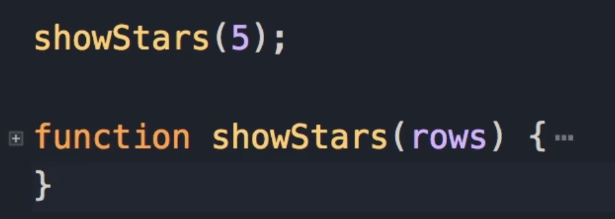
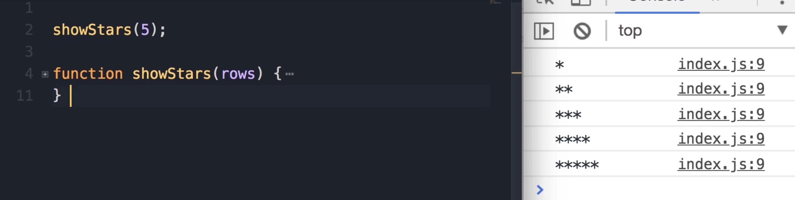
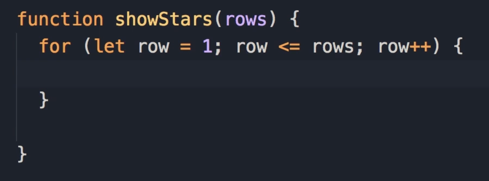
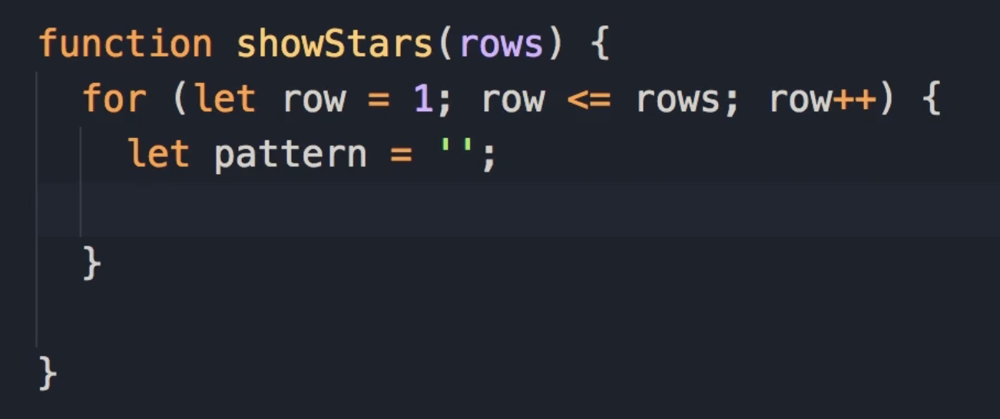
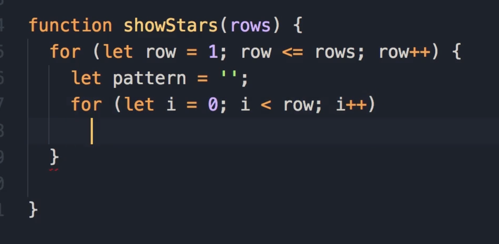
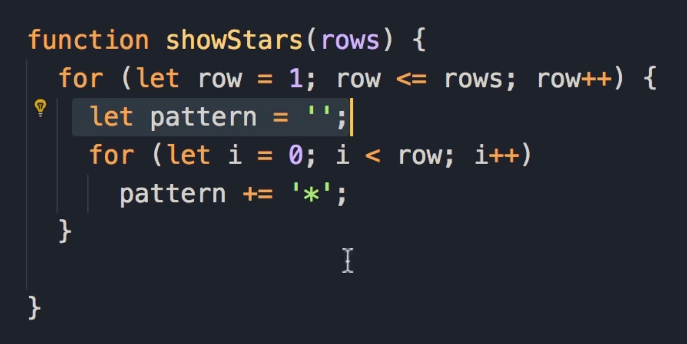

# Exercise 10 : Show Stars

This is a very popular exercise for junior programmers involving a function called `showStars` with a parameter called `rows`.



### Exercise Description

We want to create a function where the **number of stars in a row depends on the row** we are in. When we call this function and pass a number (e.g., 5), see what we get on the console:

- We get 5 rows.
  
  

- In the first row, we have one star.

- In the second row, we have 2 stars, and so on.

- If you call this function and pass 1, you get only a single star. `showStars(1)`

- If we pass 2, we get 2 rows and 2 stars. `showStars(2)`

> **Student Pause Point:** "So go ahead and spend 5-10 minutes on this exercise, when you're done, come back and continue watching."

### Solution:

1. **Initialize the Outer Loop**
   
   We need to start with a for loop. We set our variable row to 1. As long as row is less than or equal to the number of rows (the parameter), we want to increment row. **See the code below**:
   
   

2. **Initialize the Pattern Variable**
   
   - Now, in each row, **depending on the number of the row**, we need to **display one or more stars**. 
   
   - So here, I'm going to declare a variable called **pattern** and set it to an **empty string** (''). 
   
   - Now, depending on the value of the row, we need to add one or more stars to this pattern.
     
     

3. **Create the Inner Loop**
   
   Here we need another for loop. Let's call the variable i and set it to 0. As long as i is less than row, we increment i.
   
   

4. **Accumulate Stars**
   
   Inside this inner loop, we add a star to the pattern, so **pattern += '*'**.
   
   
   
   > **Why this works:** If you're on row 5, this loop will execute 5 times because we've started from 0, and we run this while `i` is less than `row`. This will execute 5 times, and each time we'll append one star to our empty string. So we'll end up with 5 stars.

5. **Log the Result**
   
   Finally, when we are done with this inner loop, we do a console.log(pattern). That's all we have to do.

### Final Code

```js
showStars(5);

function showStars(rows) {
    for (let row = 1; row <= rows; row++) {
        let pattern = '';
        for (let i = 0; i < row; i++) 
            pattern += '*';
        console.log(pattern);
    }
}
```

### Testing Methodology

Now, on the top, I'm going to change the input to 5 and save the changes.


```bash
*
**
***
****
*****
```

The algorithm works beautifully.

- **Test Case 1:** If you pass 1, we get a single star.

- **Test Case 2:** If we pass 2, we get 2 stars (2 rows).

### Key Learning: Nested Loops

What we have here is what we call a **nested loop**. So, we have a loop inside of another loop. You may see this pattern inside a lot of algorithms.
