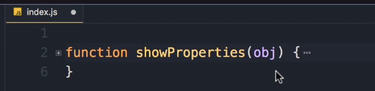
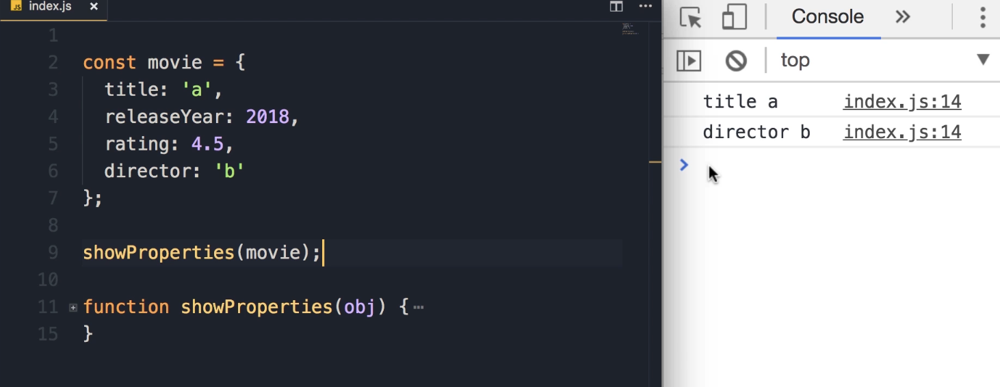
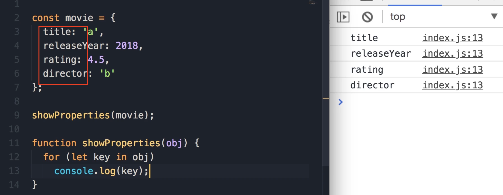

## Exercise 7 : Show Properties

 Your job is to create a function called `showProperties`. We pass an object here, and this function should display all the properties of this object that are of type **string**.



### Exercise Description

Let me give you an example. On the top, I'm going to define an object, like `movie`. Here is the **object literal syntax** to initialize this.

We are going to add a few properties:

- `title`: Set it to a simple string (the value doesn't really matter, 'a' is enough).

- `releaseYear`: Set it to a number, like 2018.

- `rating`: Again, a number.

- `director`: Set it to another string.
  
  

Now, if we call the function `showProperties` and pass this `movie` object, we should see the **string properties** of our movie object.

**Goal Output:**

```js
title a
director b
```

> **Student Pause Point:** "So pause the video, do the exercise and when you're done come back and continue watching."

## Solution & Explanation

#### 1. Iterating Properties

Here we need to use the `for...in` loop to iterate over the properties of this object.

```js
for (let key in object) {
    // Logic goes here
}
```

In each iteration, this `key` will hold the name of one of these properties. Let's have a quick look here using `console.log`.

**Code Check:**

```js
for (let key in object) 
    console.log(key);
```



#### 2. Checking Value Types

Now we need to get the value of each of these properties and then check the type of that value.

1. **Get the Value:** To get the value of this property, we use the **bracket notation**: `object[key]`.

2. **Check the Type:** To check the type of this value, we use the `typeof` operator.

3. **Condition:** We put this in an `if` statement. If the type is a string, then we'll display the property and its value.

```js
const movie = {
    title: 'a',
    releaseYear: 2018,
    rating: 4.5,
    director: 'b'
};

showProperties(movie);

function showProperties(obj) {
    for (let key in obj) {
        if (typeof obj[key] === 'string')
            console.log(key, obj[key]);
    }
}
```

**Expected Output:**

```js
title a
director b
```


