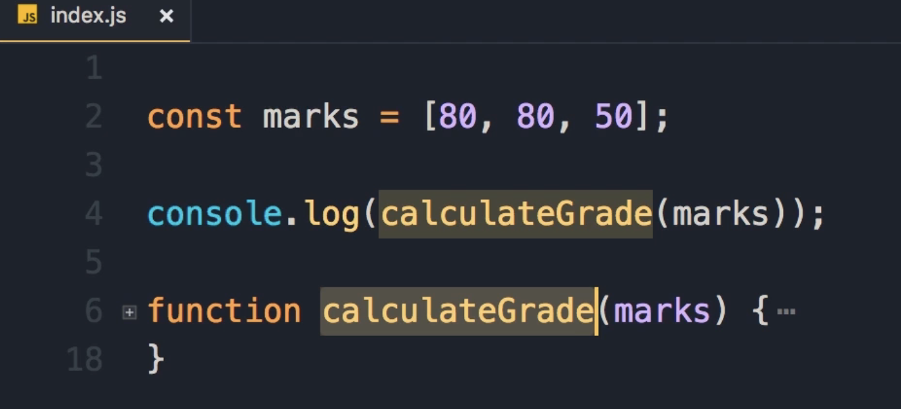
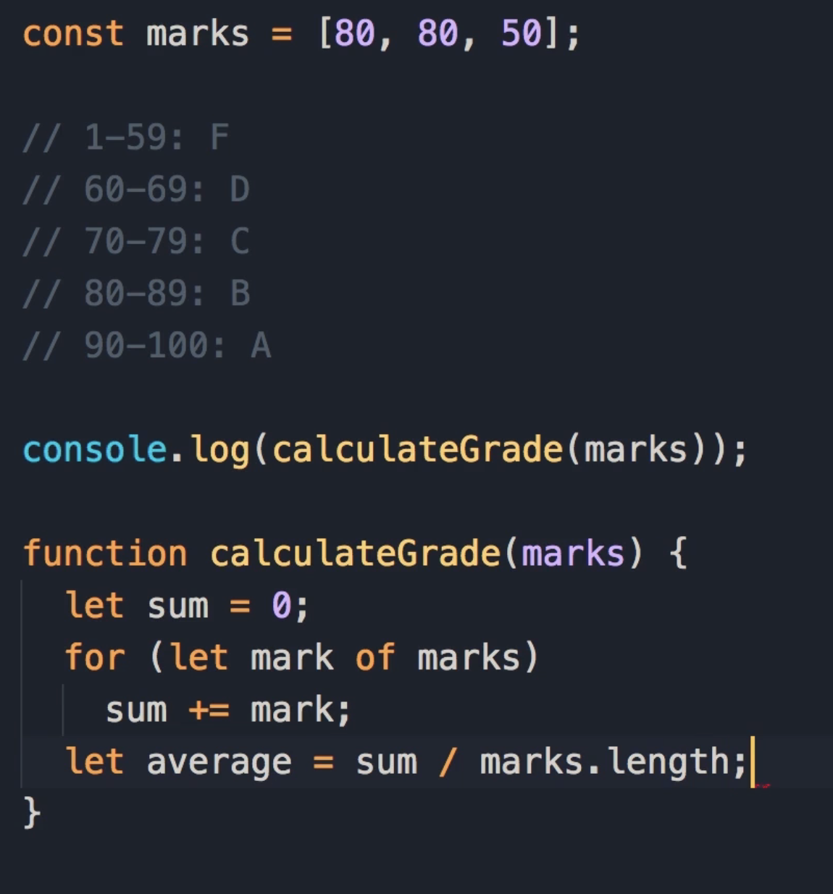
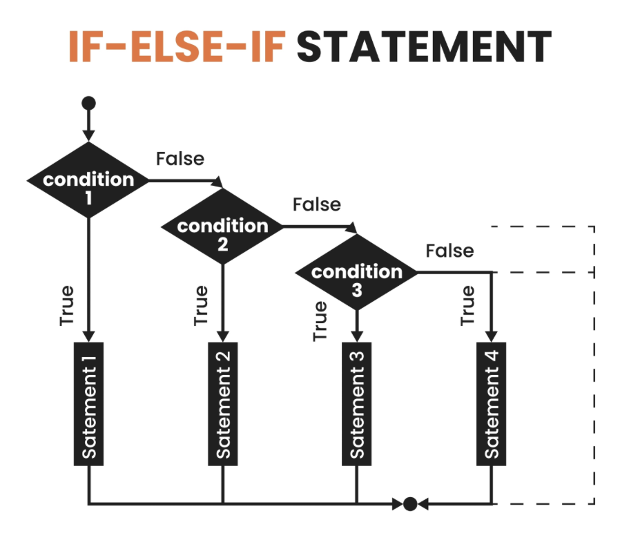
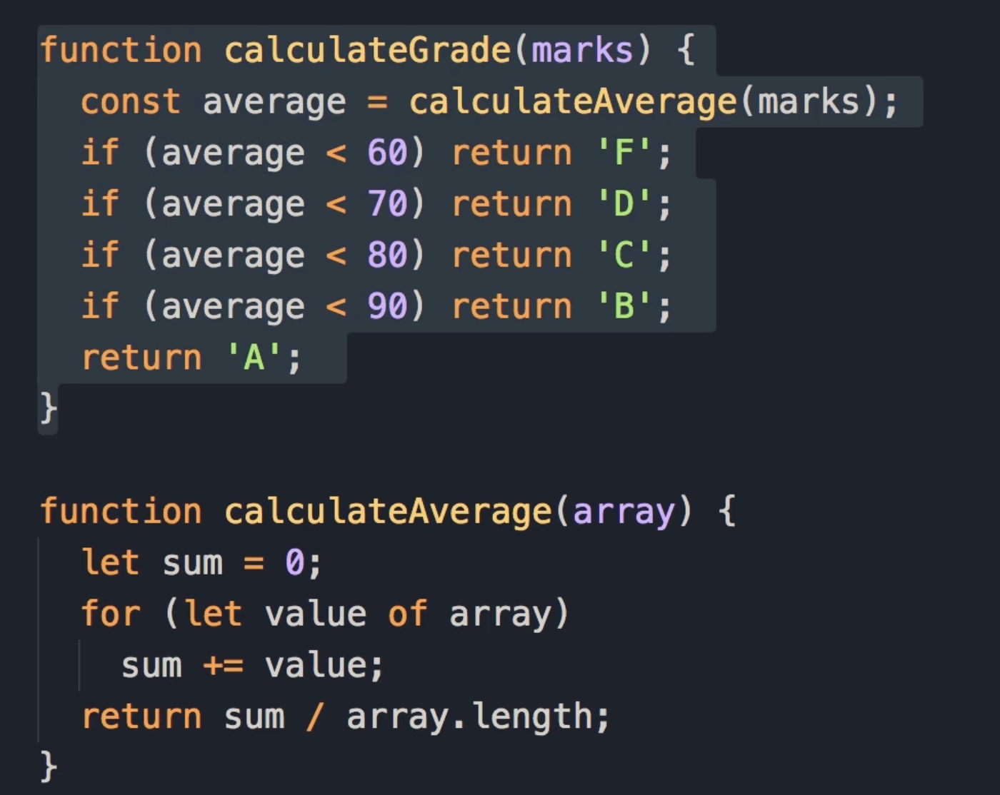

# Exercise 9 : Grade Calculator

In this exercise, we want to calculate the grade of a student based on their marks in different subjects. We pass an array of marks to a function called `calculateGrade`.



### The Logic

First, the function calculates the **average grade**.

- **Example Calculation:**
  
  - Marks: 80, 80, 50
  
  - Sum: 80 + 80 + 50 = 210
  
  - Average: 210 / 3 = 70

Next, we need a table to see what grade this average corresponds to:

- **0 - 59:** F

- **60 - 69:** D

- **70 - 79:** C

- **80 - 89:** B

- **90 - 100:** A

> **Student Pause Point:** Spend 5 to 10 minutes on this exercise. When you are done, come back and continue reading to see the solution.


## Solution:

### Phase 1: Calculating the Average

To calculate the average, we first need to calculate the sum of all the marks.

1. Declare a variable like `sum` and initialize it to 0.

2. Use a `for...of` loop to iterate over the array of marks.

3. In every iteration, get the `mark` and add it to `sum`.

```js
function calculateGrade(marks){
 let sum = 0;
 for (let mark of marks)
   sum += mark;   
}
```

**Teaching Explanation:** Now that we have the total, to get the average, we need to divide `sum` by the number of marks (which is `marks.length`).



> In JavaScript, `.length` is a property that tells you how many items are in an array or how many characters are in a string.
> 
> In the context of this **exercise**:
> 
> - `marks.length` gives the total number of subjects (grades) inside the `marks` array.
> 
> - It was used to calculate the average: `sum / marks.length` (Total Score divided by the Number of Subjects).
> 
> **Example:**
> 
> ```js
> const marks = [80, 80, 50];
> console.log(marks.length); // Output: 3
> ```

### Phase 2: Mapping Average to Grade (Logic Optimization)

Now that we have the average, we need to map it to a grade using our table.

### The "Noisy" Approach

One way to calculate the grade is using specific ranges with logical AND operators.

```js
// Range 0 to 59
if (average >= 0 && average <= 59)
  return 'F'; 
```



**Instructor Critique:**

> This code is a little bit ugly. There is so much "noise" in this code. Instead of having two conditions along with the logical AND operator, we can simplify this expression.

### The Simplified Approach

We can remove the lower bound check. Because the range for F is 0 to 59, as long as the average is less than 60, we get the same result. **See the code below**:

```js
if (average < 60) return 'F'; // because the range is from 0 to 59
```

**Leonardo Da Vinci Quote:**

> "Simplicity is the ultimate sophistication."

You should always aim for the simplest solution. Using this pattern, we can calculate the other grades by just checking the **upper limit**.

**Revised Logic:**

- If `average < 60`: Return F.

- If `average < 70`: Return D. (If we get to this point, it means the average is at least 60. So we only check if it is between 60 and 69).

- If `average < 80`: Return C.

- If `average < 90`: Return B.

- If we get past these points, the average is at least 90, so we can simply return A. **See the code below**

```js
if (average < 60) return 'F';
if (average < 70) return 'D';
if (average < 80) return 'C';
if (average < 90) return 'B';
return 'A'; 
```

**Final Code**:

```js
function calculateGrade(marks){
    let sum = 0;
    for (let mark of marks)
        sum += mark;
    let average = sum/marks.length;
    
    if (average < 60) return 'F';
    if (average < 70) return 'D';
    if (average < 80) return 'C';
    if (average < 90) return 'B';
    return 'A'; 
}
```

### Phase 3: Refactoring (Single Responsibility Principle)

Now we can make this code even better. While the function is fairly simple (about 10 lines), it is doing two different things:

1. Calculating the average.

2. Mapping the average to a grade.

### Key Concept: Single Responsibility Principle

Think of a restaurant.

- **The Chef:** Responsible for cooking (doesn't take orders).

- **The Manager:** Responsible for managing the restaurant at a high level.

Each person has a distinct role. We have the same concept in programming. Functions should be small and focused on only **one thing**.

### Refactoring Steps

1. **Extract the Logic:** We can cut the average calculation logic and put it in a separate function.

2. **Make it Generic:**
   
   - Rename the parameter from `marks` to `array`.
   
   - Rename the loop variable from `mark` to `value`.

> **IDE Tip:** Put the cursor on the variable name and press **F2** to rename it across the function.

This makes the function generic. 

- It can be an array of marks, temperatures, or anything else. **(look at the code for calculateAverage function)**

- We can **reuse this function in the future whenever we need** to calculate the average of a bunch of numbers.

**The Generic Average Function:**

```js
function calculateAverage(array) {
  let sum = 0;
  for (let value of array)
    sum += value;

  // We can return the expression result directly
  return sum / array.length;
}
```

**The Final Grade Function:** Now we simply reuse our new function inside the original one.

```js
function calculateGrade(marks) {
  const average = calculateAverage(marks);

  if (average < 60) return 'F';
  if (average < 70) return 'D';
  if (average < 80) return 'C';
  if (average < 90) return 'B';
  return 'A'; 
}
```

### Key Takeaway

With this change, we now have two very simple functions, and each function is responsible only for one thing.


