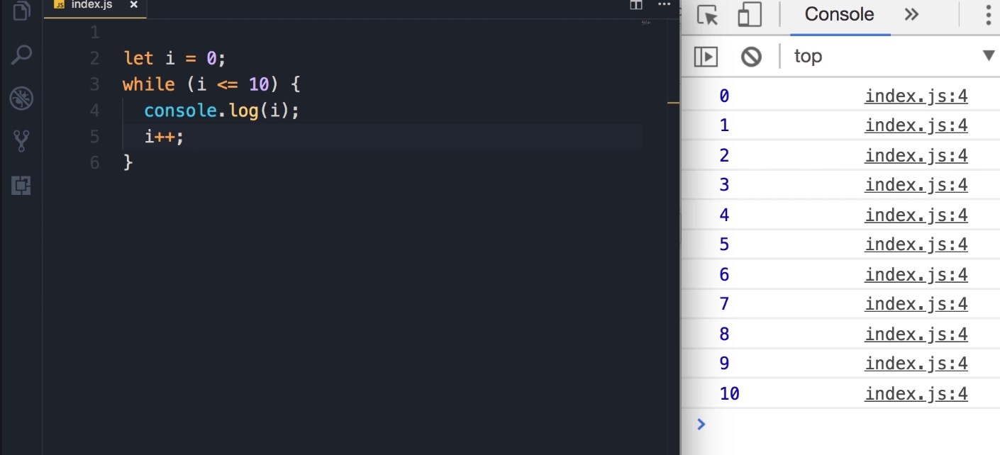
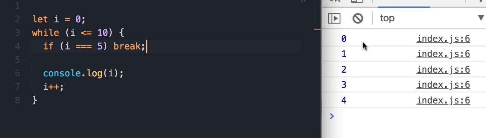
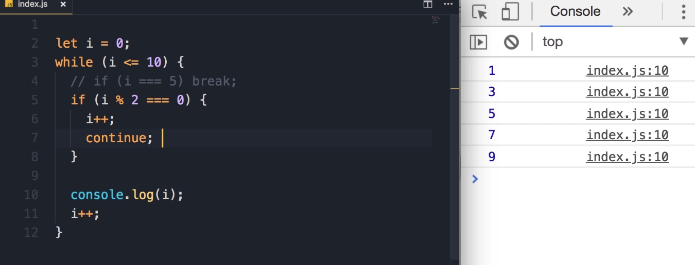

### The `break` and `continue` Keywords

With all the loops you have learned about, there are two keywords, `break` and `continue`, that can change how the loop behaves. 

In this demo, I'm going to use a `while` loop, but what you're going to learn applies to **<u>all loops we have learned in this section</u>**.

#### Basic Loop Setup

1. Let's start by declaring a variable called `i` and initializing it to 0.

2. Now, we put this in a `while` loop. As long as `i` is less than or equal to 10, we're going to display `i` on the console and then increment it.
   
   ```javascript
   let i = 0;
   while (i <= 10) {
      console.log(i);
      i++;
   }
   ```

3. Save the changes. This gives us the numbers 0-10.
   
   
   
   **Output:**
   
   ```javascript
   0
   1
   2
   3
   4
   5
   6
   7
   8
   9
   10
   ```

#### Using the `break` Keyword

Now, sometimes you want to **jump out of a loop for some reason** that may happen at runtime.

1. For example, here we can have an `if` statement with a condition. Let's say if `i` equals 5, we want to jump out of this loop. That's where we use the `break` keyword.
   
   ```javascript
   let i = 0;
   while (i <= 10) {
      if (i===5) break;
      console.log(i);
      i++;
   }
   ```

2. We will modify the loop to add the `if` statement inside the loop, after the increment, so it stops after printing `4`.

3. Now when we save the changes, see what happens. We get the numbers 0 to 4.
   
   
   
   **Output:**
   
   ```javascript
   0
   1
   2
   3
   4
   ```

#### Using the `continue` Keyword

Now, let me comment this out and look at the `continue` keyword.

```javascript
let i = 0;
while (i <= 10) {
   // if (i===5) break;
   if (i%2===0){
    i++;
    continue;
   }
   console.log(i);
   i++;
}
```

1. I'm going to write another `if` statement. I want to see if `i` is an **even number or not**. So, `i` modulus 2 equals 0.

2. If that's the case (if `i` is even), I want to increment `i` and then `continue`. **The `continue` keyword will jump to the beginning of the loop, skipping the code that comes after it.**

3. To get this to work and only log the odd numbers, the code needs to handle incrementing in two places: 
   
   1. once for the even numbers ***before* continuing**, and 
   
   2. once for the odd numbers ***after* logging**.

4. Save the changes. We only get the odd numbers.
   
   
   
   **Output:**
   
   ```javascript
   1
   3
   5
   7
   9
   ```

5. **Why is that?** Alright, let's take a look at an example.
   
   - When `i` becomes 2, it's an even number.
   
   - At this point, we increment `i`, so `i` will be 3.
   
   - Now when the JavaScript engine sees the `continue` keyword, it will jump to the beginning of the loop and continue its execution in the next iteration.
   
   - At this point `i` is 3, so this `if` statement is not executed. That's why we see `i` (which is 3) on the console.


**Note on `continue`** :

In my personal experience, `continue` **<u>is not something you will use that often. It's one of those old, legacy things in JavaScript</u>**. I'm only explaining it here in case you see it in projects you're working on. It's not something that I recommend you to use; it's an **<u>ugly way of writing code</u>**.


**Key Takeaway** Just to recap:

- With the `break` keyword, you jump **out** of a loop.

- With the `continue` keyword, we jump to the **next iteration**.
