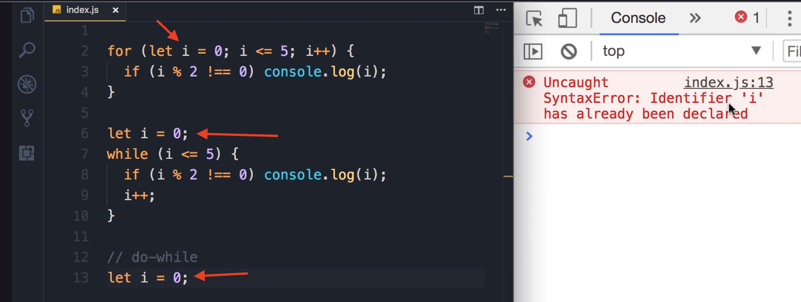
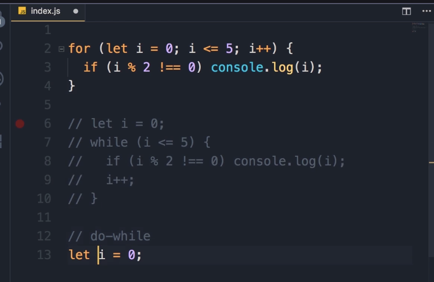
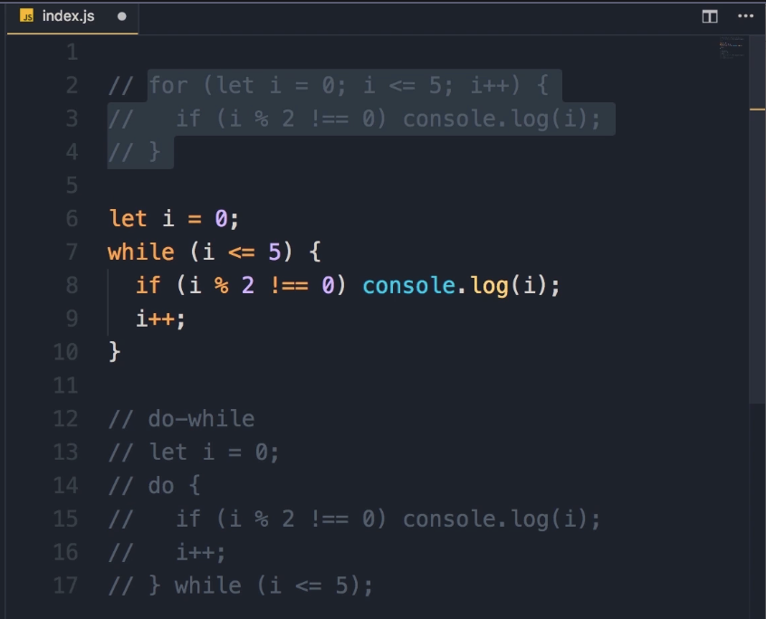
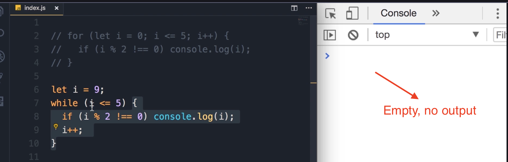
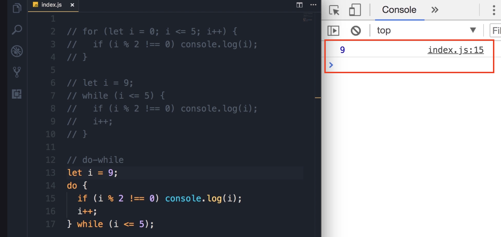

# The `do-while` Loop

Alright, now let's take a look at the third kind of loop we have in JavaScript: the **`do-while` loop**. `do-while` loops are very similar to `while` loops, but they're slightly different.

It's easier to show you in code. I'm going to rewrite this logic (displaying odd numbers) using a `do-while` loop.

1. Just like `while` loops, we have to declare our loop variable externally.
   
   ```javascript
   let i = 0;
   ```

2. **Note on Scope:** Okay, now if we save the changes, we're going to get an error: `Identifier has already been declared`. 
   
   
   
   > This is because I have declared `i` here (for the `do-while` loop) and also had it declared for the `while` loop. I cannot redeclare it here. This is different than the `i` that we have in the `for` loop. Again, this is all about **scoping**, and I'm going to talk about that later in the course.

3. To make this work, I'm going to temporarily comment out these few lines and rewrite this logic using a `do-while` loop.
   
   

4. We add the `do` statement here, then a code block. In this block, we should have our statements. I'm going to borrow them from our `while` loop (copy and paste them here).

5. Finally, at **the *end* of this block**, we add the `while` statement along with our condition (`i <= 5`), followed by a semicolon.
   
   ```javascript
   // Assuming 'i' was declared externally, e.g., let i = 0;
   // (Previous 'while' and 'for' loops are commented out)
   
   do {
      // Statements borrowed from the while loop
      if (i % 2 !== 0) {
          console.log(i);
      }
      i++;
   } while (i <= 5);
   ```

### Key Difference: `while` vs. `do-while`

Now, you might be wondering: what is the difference between a `while` loop and a `do-while` loop?

**Key Takeaway: Execution Order**

do-while loops are **<u>always executed at least once</u>**, even if this condition **<u>evaluates to false</u>**.

Let me show you what I mean.

#### Scenario 1: The `while` loop

1. I'm going to temporarily comment out these few lines and bring back our `while` loop. (Also, we don't need this `for` block for now, so let's comment it out).
   
   

2. If you save the changes (with `let i = 0`), we get `1, 3, 5` on the console.

3. However, if I change `i` to 9:
   
   ```javascript
   let i = 9;
   
   while (i <= 5) {
      if (i % 2 !== 0) {
          console.log(i);
      }
      i++;
   }
   ```

4. We are not going to see anything. Save the changes, and look, there's nothing in the console.
   
   

5. **Reason:** In `while` loops, this condition is **<u>evaluated *ahead of time*</u>**—at the beginning of every iteration. The first time we try to execute this `while` loop, the condition (`9 <= 5`) evaluates to `false`, so these statements below while loop, are never executed.

#### Scenario 2: The `do-while` loop

1. In contrast, in `do-while` loops, **<u>this condition is evaluated *at the end*</u>**. And that means these statements are always executed at least once, even if the condition is false.

2. Let's try this. I'm going to comment out this `while` loop and change `i` to 9, just like before.
   
   ```javascript
   let i = 9;
   
   do {
      if (i % 2 !== 0) {
          console.log(i);
      }
      i++;
   } while (i <= 5);
   ```

3. Save the changes.

4. **Expected Output:**
   
   ```javascript
   9
   ```

5. **Reason:** Why? Because in our `do-while` loop here:
   
   - On line 15 (in the video), we check to see if this is an odd number. It is.
     
     
   
   - We display it on the console.
   
   - Next, we increment `i` by 1, so `i` is 10.
   
   - *Then*, the condition is evaluated. Of course, it's `false` (`10 <= 5`). So our loop will terminate.

### Note: Practical Usage

Now, **realistically, we're not going to use this `do-while` a lot in programming**. There are situations you may want to use this, but in practical terms, most of the time you will be using a `for` or `while` loop. Just be aware of the difference between a `while` loop and a `do-while` loop.
