# JavaScript Exercises

## Exercise Description 1 : Max of 2 numbers

Here's an exercise for you: 

**Write a function that takes two numbers and returns the maximum of the two. Call that function, give it different arguments, and make sure it's working properly.**

## Solution 1

#### Step 1: Defining the `max` Function

I'm going to start by defining a function, call it `max`. Here we need two parameters. We can call them `number1` and `number2`, or we can use shorter names like `a` and `b`.

> **A Note on Variable Names:** Earlier I told you not to use mysterious variable names like `a` and `b`, but in this particular case, it doesn't really matter. Because `a` and `b` are kind of self-explanatory, we are not dealing with a complex logic; we don't have to guess what `a` and `b` are.

In this function, we want to have some logic to compare the value of `a` with `b`, so we're going to use an `if` statement.

```javascript
function max(a, b) {
  if (a > b)
    return a;
  else
    return b;
}
```

That's the simplest implementation. It's not the best way; we're going to optimize this step-by-step.

#### Step 2: Testing the Function

Before going any further, let's make sure that this function actually works. I'm going to declare a variable called `number` and set it to `max` of 1 and 2. Now let's display `number` on the console.

```javascript
let number = max(1, 2);
console.log(number);
```

**Testing Case 1: Second argument is greater**

- **Code:** `max(1, 2)`

- **Expected Output:** `2`

**Testing Case 2: First argument is greater**

- **Code:** `max(3, 2)` (changing 1 to 3)

- **Expected Output:** `3`

**Testing Case 3: Both arguments are equal**

- **Code:** `max(3, 3)`

- **Expected Output:** `3`

#### Key Takeaway: The Importance of Testing

Did you notice how I called this function with different arguments? I called it with different test cases.

1. First, I assumed that the second argument is greater.

2. Then, I assumed if the first argument is greater.

3. And finally, I assumed that both arguments are equal.

> **Note:** When writing code, when writing functions, you should test your functions with different possible values.

#### Step 3: Code Optimization (Removing `else`)

Now, let's get back to this `max` function and clean up this code.

The first thing I want to improve here is to remove this `else` keyword. Why?

- Because if `a` is greater than `b`, we're going to `return a`.

- When we `return a`, we'll jump out of this function.

- So none of the code after that line will be executed; in fact, it will never get to this point.

So we don't really need the `else` keyword. If `a` is greater than `b`, we'll return `a`, otherwise, we'll return `b`.

```javascript
function max(a, b) {
  if (a > b)
    return a;

  return b;
}
```

This is a cleaner implementation.

#### Step 4: Code Optimization (Using the Conditional Operator)

But hey, we can make this even cleaner. Earlier we learned about the **conditional operator**. Remember this `?`

We add a condition in parenthesis, then a question mark (`?`). If this condition evaluates to `true`, we use one value, otherwise (using a colon `:`) we use the other value.

We can rewrite these two lines using our conditional operator.

- What is the condition here? `(a > b)`

- If this condition is true, we want to return `a`.

- Otherwise, we want to return `b`.

All we need here is a `return` statement and to terminate this with a semicolon.

```javascript
function max(a, b) {
  // This line is exactly equivalent to the previous two lines.
  return (a > b) ? a : b;
}
```

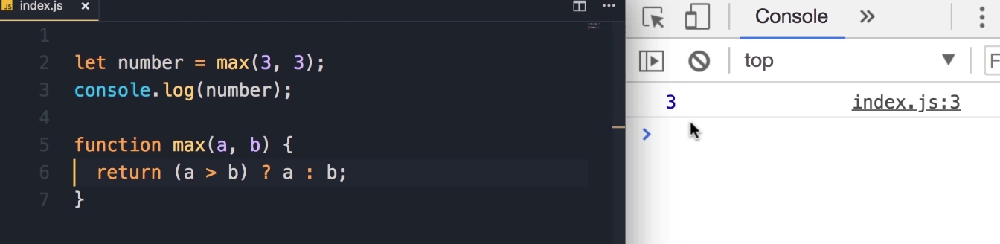

#### Step 5: Testing the Final Optimized Function

Now, save the changes and let's try another test case.

**Test 1: Equal arguments**

- **Code:** `let number = max(3, 3);`

- **Output:** `3`

**Test 2: First argument larger**

- **Code:** `let number = max(5, 3);`

- **Output:** `5`

**Test 3: Second argument larger**

- **Code:** `let number = max(5, 10);`

- **Output:** `10`

Beautiful. So our function is working.

---

## Exercise 2 : isLandscape Function

Here is another exercise. I want you to:

**Implement the function `isLandscape`. It takes two parameters, `width` and `height` of an image, and returns `true` if the image is landscape (which means `width` is greater than `height`), otherwise it returns `false`.**

> **Note:** Now you may think this is similar to the exercise in the last lecture, in fact it is. But I want you to do this exercise because I'm going to give you a simple and effective tip to write better code.

## Solution 2

Alright, so similar to the last lecture, we can start with a simple `if` and `else`.

1. Initial if/else Implementation
   
   So if width is greater than height, you want to return true, otherwise we want to return false.
   
   ```javascript
   function isLandscape(width, height) {
    if (width > height)
      return true;
    else
      return false;
   }
   ```

2. Conditional Operator Implementation
   
   But I told you that in this case we can use the **conditional operator**. So, we add the condition **if width is greater than height**, we can return true, otherwise we'll return false. And here's our return statement, right?
   
   ```javascript
   (condition)? if true : if false
   ```
   
   ```javascript
   function isLandscape(width, height) {
    return (width > height) ? true : false;
   }
   ```
   
   So here's the implementation of this function.

### Key Takeaway: A Tip for Better Code

However, code like this looks very **amateurish**. You don't want to return `true` or `false` explicitly. This is very ugly. Why? Well, let me show you.

We can completely delete this part here (`? true : false`) and simply return the value of this expression.

**Final, Optimized Implementation**

```javascript
function isLandscape(width, height) {
  return (width > height);
}
```

**Explanation**:

If width is greater than height, this expression (width > height) will be evaluated to true. So, you will simply return true. Otherwise, if width is less than height, this expression will evaluate to false, so it will return false.

> So there is really no need to explicitly return `true` and `false` here, that's a poor way of writing code.

### Testing the Function

So, now we have this function, let's test it.

1. We can do a `console.log`, simply call this function here `isLandscape`, I'm going to pass these dimensions 800 by 600. So we expect `true` on the console.
   
   ```javascript
   console.log(isLandscape(800, 600));
   ```
   
   Save the changes, here's `true`
   
   - **Expected Output:** `true`

2. Now let's change the width to, let's say, 300. Now we have a vertical image.
   
   ```javascript
   console.log(isLandscape(300, 600));
   ```
   
   Save. So we get `false`.
   
   - **Expected Output:** `false`

---

## Exercise 3: The FizzBuzz Algorithm

This next exercise is a very popular interview question called the **FizzBuzz** algorithm. 

We have this function called `fizzBuzz` that we give an input to, and it **returns a string**.

Let me show you how that works. Let's declare a constant called `output` and call `fizzBuzz`, passing an input like `3`. Then, we log the `output` on the console.

```javascript
// Initial setup to test the function
const output = fizzBuzz(3);
console.log(output);

function fizzBuzz(input){ ...
}
```

Let's see what we get.

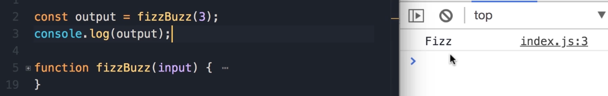

We get `Fizz`.

### Exercise Description

Here are the requirements for the `fizzBuzz` function:

- If the number that we're passing is **divisible by 3**, we get `Fizz`.
  
  - Example: `fizzBuzz(3)` => `Fizz`

- If the number that we pass is **divisible by 5**, we get `Buzz`.
  
  - Example: `fizzBuzz(5)` => `Buzz`

- If the number that we're passing is **divisible by both 3 and 5**, we get `fizzBuzz`.
  
  - Example: `fizzBuzz(15)` => `FizzBuzz`

- If the number is **not divisible by either 3 or 5**, we're going to get the same number back.
  
  - Example: `fizzBuzz(7)` -> `7`

- If we don't pass a number (e.g., we pass a string, a boolean, or anything that is not a number), we should get this message: `Not a number`.

> **Student Pause Point:** I want you to pause and spend 10-15 minutes on this exercise, and when you're done, come back and continue reading the solution below.

## Solution 3

Alright, let's see how we can implement this `fizzBuzz` function.

### Step 1: Check the Input Type

First, we want to see if the `input` is a number or not. Because if it's not a number, then we don't care about dividing that number by 3 or 5.

1. For that, we use the `typeof` operator.

2. So, if `typeof input` is not `'number'`, we want to return the message: `Not a number`.

3. That's the first `if` statement in this function.

```javascript
function fizzBuzz(input) {
  if (typeof input !== 'number') {
    return 'Not a number';
  }
}
```

### Step 2: Add Logic for Divisibility (Initial Attempt)

Now, if we get to this point, that means we have a number. We want to see if this number is divisible by 3, 5, both of them, or none of them.

1. We can write the `if` statements like this:

2. If `input % 3 === 0`, that means this number is divisible by 3, so we `return 'Fizz'`.

3. Similarly, we have another `if` statement. If `input % 5 === 0`, we're going to `return 'Buzz'`.

4. Next, we want to see if this number is divisible by both 3 and 5. So, if `input % 3 === 0` **and** `input % 5 === 0`.
   
   - > **Teaching Tip:** Here we're dealing with a complex expression. To make this code more readable, I would like to put each expression in parenthesis, like this: `(input % 3 === 0) && (input % 5 === 0)`.
   
   - > **IDE Tip:** We can select an expression and type the opening parenthesis `(`, and this automatically adds the closing parenthesis. That's a quick tip for you.

5. If this number is divisible by both 3 and 5, we want to `return 'fizzBuzz'`.

6. Finally, if we get to this point, that means the number is not divisible by either 3 or 5. So we simply `return` the same `input`.

Here is the code from our first attempt:

```javascript
function fizzBuzz(input) {
  if (typeof input !== 'number') {
    return 'Not a number';
  }

  if (input % 3 === 0) {
    return 'Fizz';
  }

  if (input % 5 === 0) {
    return 'Buzz';
  }

  if ((input % 3 === 0) && (input % 5 === 0)) {
    return 'FizzBuzz';
  }

  return input;
}
```

### Step 3: Testing and Debugging

Now let's test this function.

1. **Test Case: `false`**
   
   - Initially, let's pass `false`. We should get `Not a number` on the console.
   
   - `const output = fizzBuzz(false);`
     
     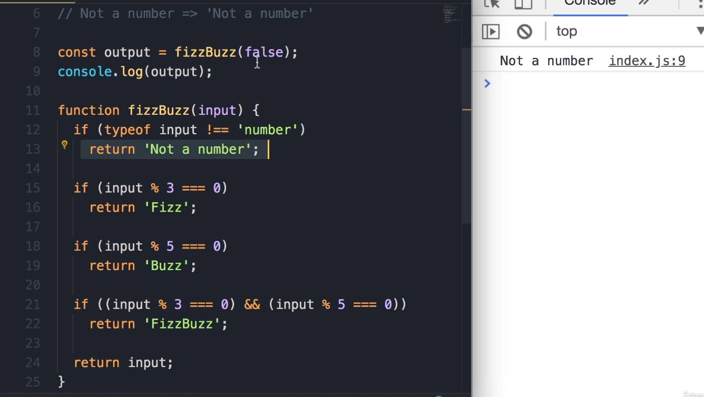
   
   - **Result:** `Not a number`. 

2. **Test Case: `3`** and `5`
   
   - `const output = fizzBuzz(3);`
   
   - **Result:** `Fizz`. 
   
   - `fizzBuzz(3)` -> `Fizz`.
   
   - `fizzBuzz(5)` -> `Buzz`. 

3. **Test Case: `15`  🚨(The Bug)** 🚨
   
   - What if we pass `15`? 
     
     `15` is divisible by both 3 and 5, so we should get `fizzBuzz`.
   
   - `const output = fizzBuzz(15);`
     
     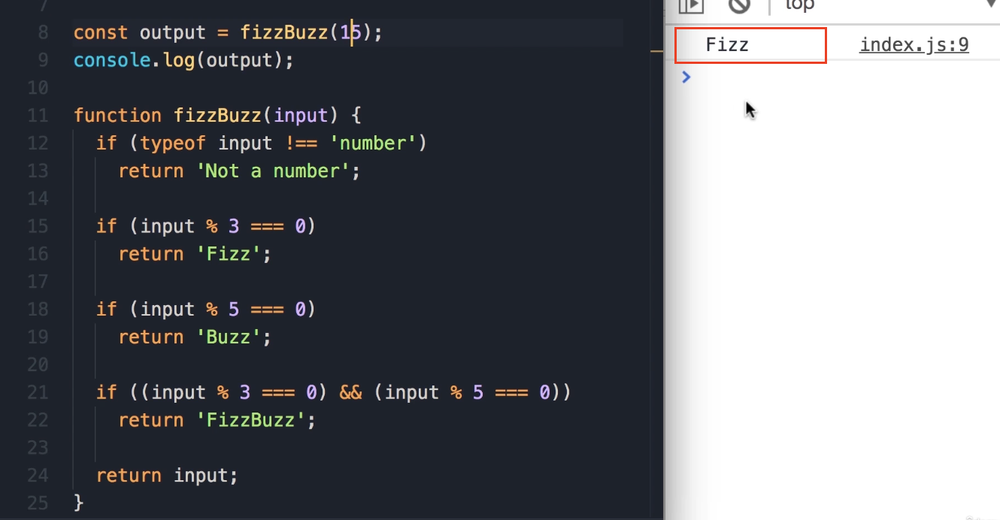
   
   - **Result:** `Fizz`.
   
   - Wait a sec, what happened here? We got `Fizz` when we expected `fizzBuzz`.
   
   - **Debugging the Logic:** The reason for that is because of how we have ordered our `if` statements. In this case, `15` is divisible by 3, so this first `if` statement (`if (input % 3 === 0)`) is executed, and here we immediately `return 'fizz'`. The function execution stops, and the other `if` statements are never checked. (**see the image or code above**)

### Step 4: Fixing the Bug (Code Optimization)

To solve this problem, we need to move the most specific `if` statement to the top. The check for divisibility by *both* 3 and 5 is the most specific one.

1. Select the two lines for the `fizzBuzz` check.
   
   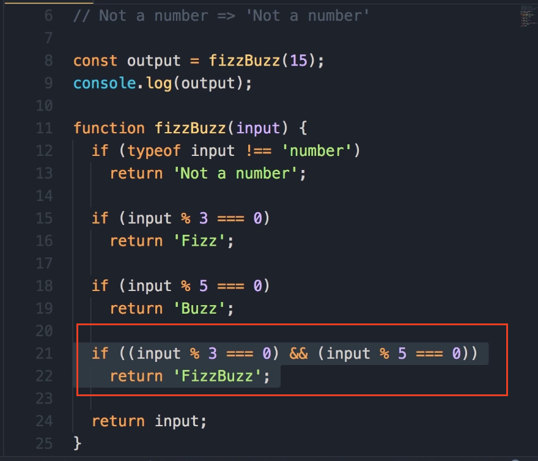

2. To move this code up, we can simply press the **alt key and the up arrow**. Simple as that.

3. We will move this block to be the *first* check after the `typeof` validation.

Here is the corrected code:

```javascript
function fizzBuzz(input) {
  if (typeof input !== 'number') {
    return 'Not a number';
  }

  // Moved this block to the top
  if ((input % 3 === 0) && (input % 5 === 0)) {
    return 'fizzBuzz';
  }

  if (input % 3 === 0) {
    return 'fizz';
  }

  if (input % 5 === 0) {
    return 'buzz';
  }

  return input;
}
```

### Step 5: Retesting the Function

1. **Test Case: `15` (Fixed)**
   
   - Now, let's save the changes.
   
   - `const output = fizzBuzz(15);`
   
   - **Result:** `FizzBuzz`. Okay, the problem is solved.

2. **Test Case: `7`**
   
   - What if we pass a number that is not divisible by 3 or 5? Let's say `7`.
   
   - `const output = fizzBuzz(7);`
   
   - **Result:** `7`. We get the same input.

So this is the FizzBuzz algorithm that you see in a lot of programming interviews.

### Key Learning: The `NaN` Value

Now I want to show you something. In JavaScript, we have this special value called **`NaN`**, which stands for "Not a Number".

1. Here, I'm going to replace the string `"Not a number"` with `NaN`.
   
   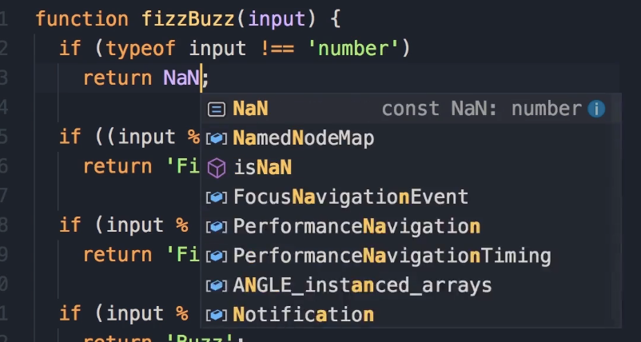

2. Whenever you're dealing with some **mathematical calculation**, if the result is **<u>not a number</u>**, this value is returned. So we can use this **<u>same value instead of returning a string</u>**.

3. This was not part of the exercise, it's something that I'm teaching you now.

Here is the final version of the code:

```javascript
function fizzBuzz(input) {
  if (typeof input !== 'number') {
    return NaN; // Return the special NaN value
  }

  if ((input % 3 === 0) && (input % 5 === 0)) {
    return 'fizzBuzz';
  }

  if (input % 3 === 0) {
    return 'fizz';
  }

  if (input % 5 === 0) {
    return 'buzz';
  }

  return input;
}
```

Let's save the changes. Now, instead of passing a number, let's pass `false`.

```javascript
const output = fizzBuzz(false);
console.log(output);
```

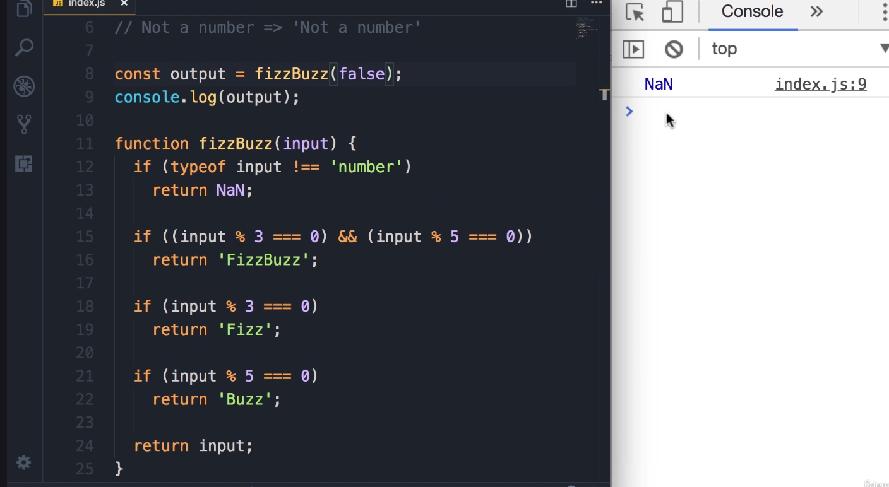

Now we get `NaN`.

> **Key Takeaway**: Let's take a look at the type of this value.
> 
> 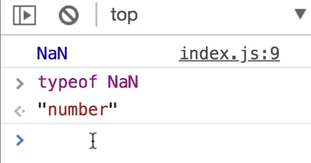
> 
> `console.log(typeof NaN);`
> 
> Weirdly enough, the type of this value is... a `'number'`. The value is just something specific that is **not a *valid* mathematical number**.

---

## Exercise 2: `checkSpeed` Function

Alright, here's another exercise, but this exercise is a little more complicated than the earlier exercises.

**Exercise Description**

1. We need to implement a function called `checkSpeed`, which takes one parameter: `speed` (the speed of a car).

2. In this program, we are assuming the **speed limit is 70 km/h**.

3. If a car is driving under the speed limit, we should get an "Ok" message on the console.

4. Similarly, if we pass 70 (driving exactly at the speed limit), we're still good and should get the "Ok" message.

5. For every **5 kilometers** above the speed limit, the driver is going to get **1 point**.
   
   - `checkSpeed(75)` should result in 1 point.
     
     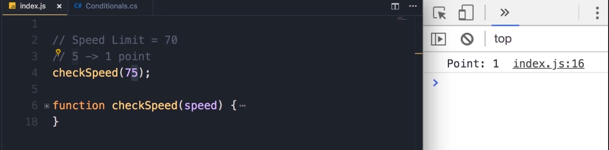
   
   - `checkSpeed(72)` is still good (not yet a full 5 km over).
     
     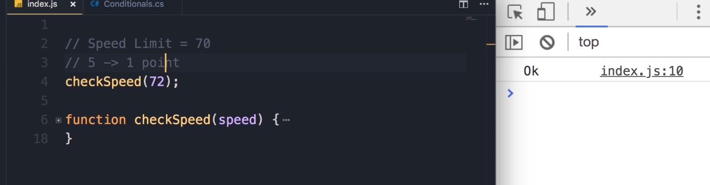

6. As part of calculating the point, you will have to use one of the **built-in functions** in JavaScript: `Math.floor()`. We can give this function a floating-point number (like 1.3 points), and this will convert that to the greatest integer.
   
   - `Math.floor(1.3)`
   
   - **Output:** `1`

7. If you pass 80, we should get 2 points.

8. If a driver gets **more than 12 points**, their license should be **suspended**.
   
   - `checkSpeed(180)` should result in "License Suspended".
     
     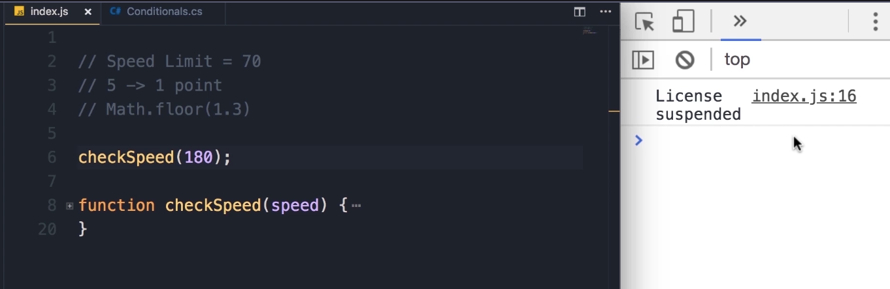

> **Pause and Try:** I want you to spend 15-20 minutes to do this exercise. Once you're done, come back and see the solution.

### Instructor's Solution and Walkthrough

Alright, now let's see how I solved this problem.

1. First, let's define the function:
   
   ```javascript
   function checkSpeed(speed) {
   
   }
   ```

2. We want to see if the speed is less than the speed limit.
   
   ```javascript
   function checkSpeed(speed) {
      if (speed < 70) {
          console.log('Ok');
      }
   }
   ```

3. Refactoring Magic Numbers (Part 1)
   
   The first thing I want to improve here is to turn this "magic number" (70) into a constant. Someone else looking at this code may not know what 70 represents.
   
   > You should avoid using magic numbers in your code; always use constants to describe them.
   
   ```javascript
   function checkSpeed(speed) {
      const speedLimit = 70;
      if (speed < speedLimit) {
          console.log('Ok');
      }
   }
   ```
   
   With this change, **our code is more expressive**. Also, if we want to use this number somewhere else in this function, we don't have to repeat it. If tomorrow the speed limit changes to 75, there is only a **single place that we have to change**.

4. Adding the **else Block** and Calculating Points
   
   Otherwise (if the speed is not less than the speed limit), we should calculate the points.
   
   ```javascript
   function checkSpeed(speed) {
      const speedLimit = 70;
      if (speed < speedLimit) {
          console.log('Ok');
      } else {
          // Simple calculation
          const points = (speed - speedLimit) / 5; 
      }
   }
   ```

5. Refactoring Magic Numbers (Part 2)
   
   Once again, we don't want to use this magic number 5 here; it's not descriptive. We want to turn this into a constant.
   
   ```javascript
   function checkSpeed(speed) {
      const speedLimit = 70;
      const kmPerPoint = 5; // New constant
   
      if (speed < speedLimit) {
          console.log('Ok');
      } else {
          const points = (speed - speedLimit) / kmPerPoint;
      }
   }
   ```

6. **Using `Math.floor()`**
   
   The result of this expression can be a floating-point number. We need to use Math.floor() to convert that to the greatest integer.
   
   ```javascript
   // ... inside the else block
   const points = Math.floor((speed - speedLimit) / kmPerPoint);
   ```

7. Checking Points and Displaying Output
   
   Now we should check to see if the driver gets 12 or more points.
   
   > **Key Takeaway**: const vs. let
   > 
   > Technically, I could use `let` for **points**, but `const` is better practice to make sure I don't accidentally **<u>modify points</u>**. `const` should be your default choice. If you want to reassign a variable, that's when you use the let keyword.
   
   ```javascript
   // ... inside the else block
   const points = Math.floor((speed - speedLimit) / kmPerPoint);
   if (points >= 12) {
      console.log('License Suspended');
   } else {
      console.log('Points', points);
   }
   ```

### Testing Methodology and Debugging

Now let's test this program. It's very important when we write a function to test it with different values.

1. **Test Case 1:** `checkSpeed(50);`
   
   - **Output:** `Ok`
   
   - *So far, so good.*

2. **Test Case 2 (Bug 1):** `checkSpeed(70);`
   
   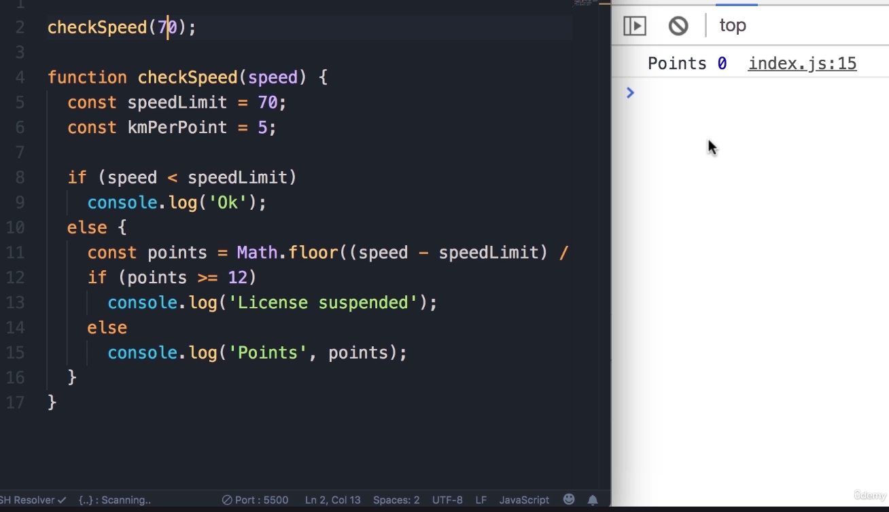
   
   - **Output:** (Nothing)
   
   - **Bug:** Hmm, that's weird. Instead of getting 0 points, we should get the "Ok" message. There is a bug in our condition.
   
   - **Fix 1:** Change `if (speed < speedLimit)` to `if (speed <= speedLimit)`.
     
     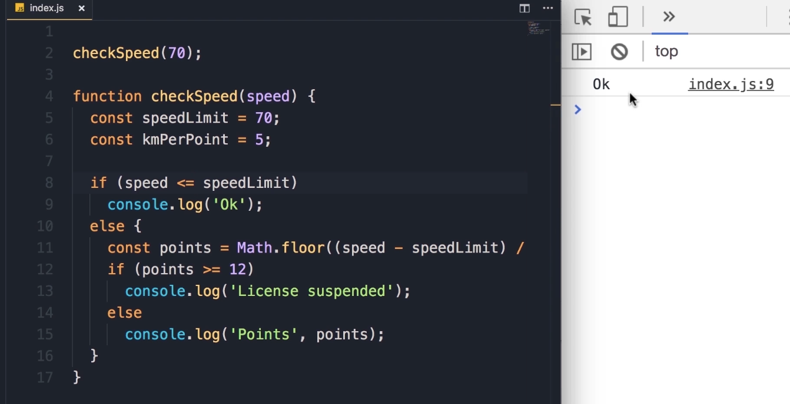
   
   - *Save the changes. Now the bug is solved.*

3. **Test Case 3 (Bug 2):** `checkSpeed(71);`
   
   - **Output:** `Points 0`
   
   - **Bug:** "We got 0 points, so we still have a bug in this function." We should still get the "Ok" message, because starting from 75 we should get the first point.
   
   - **Fix 2 Logic:** Well, we should actually change this condition... 
     
     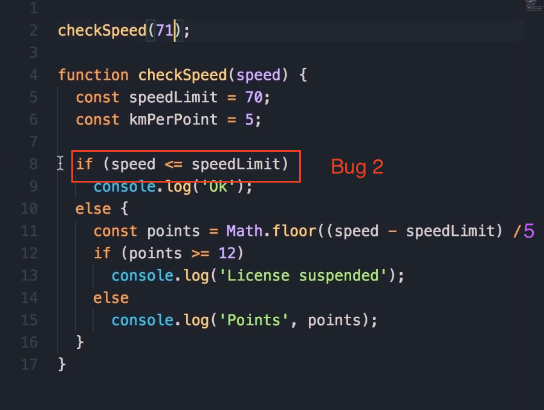
     
     Now **understand the code changes very well below**:
     
     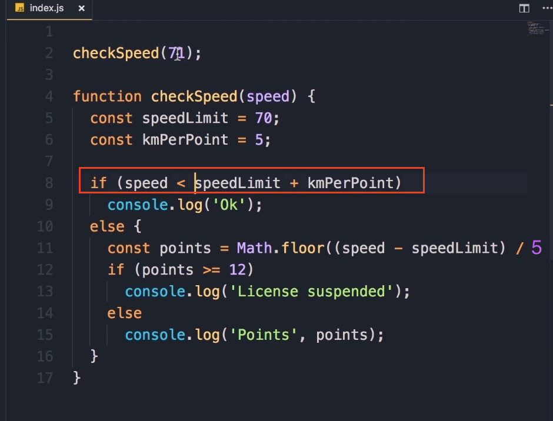
     
     We want to get the `speedLimit` (70) and add `kmPerPoint` (5), so that would give us 75. **If we drive less than 75, we are still good. But from 75 km/h or faster, we should get a point**.

4. **Test Case 4:** `checkSpeed(71);` (After Fix 2)
   
   - **Output:** `Ok`
     
     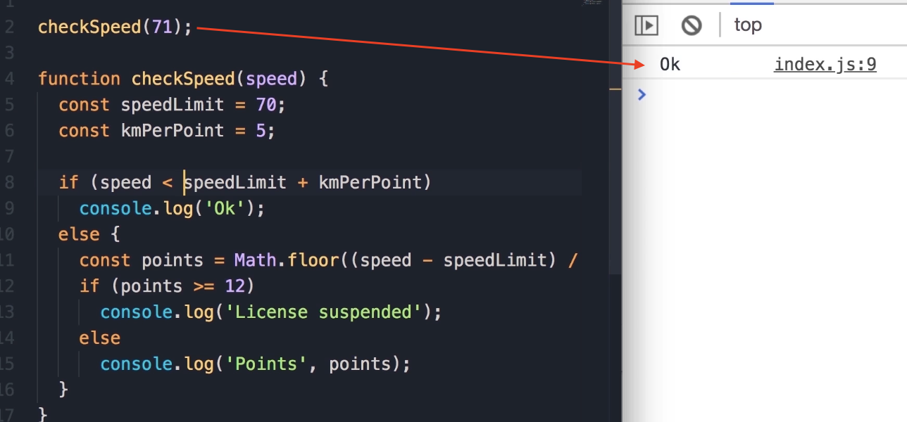
   
   - *"At 71 miles an hour we get the ok message, beautiful."*

5. **Test Case 5:** `checkSpeed(75);`
   
   - **Output:** `Points 1`
     
     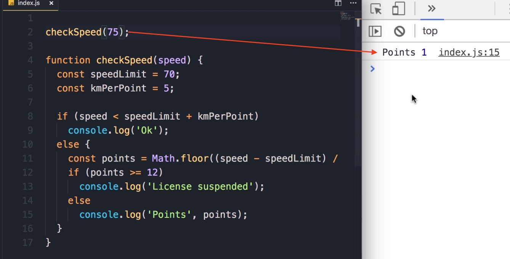
   
   - *"Beautiful."*

6. **Test Case 6:** `checkSpeed(77);`
   
   - **Output:** `Points 1`
     
     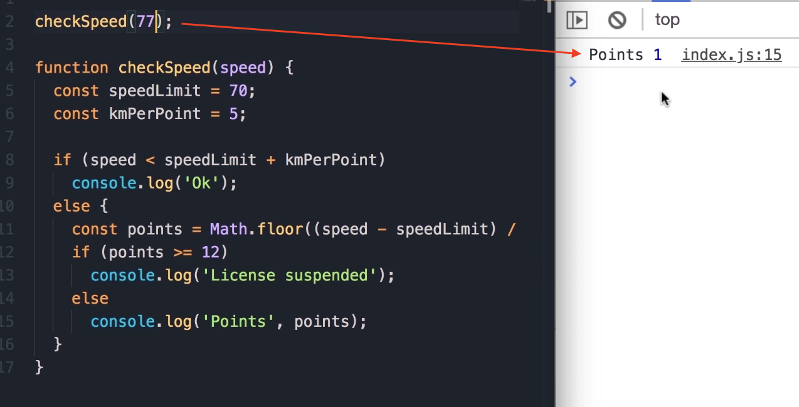
   
   - *"Beautiful."*

7. **Test Case 7:** `checkSpeed(80);`
   
   - **Output:** `Points 2`
     
     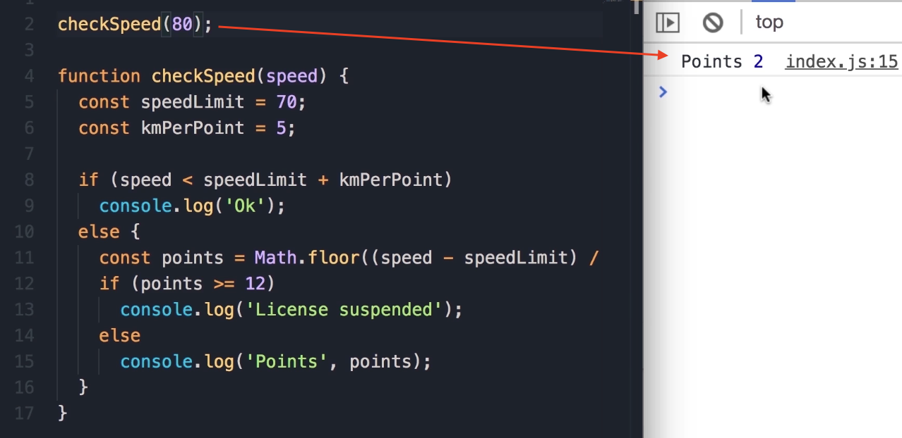
   
   - *"There you go."*

8. **Test Case 8:** `checkSpeed(130);`
   
   - **Logic:** To get 12 points, we have to drive 12 * 5 = 60 km above the speed limit (70 + 60 = 130).
   
   - **Output:** `License Suspended`
     
     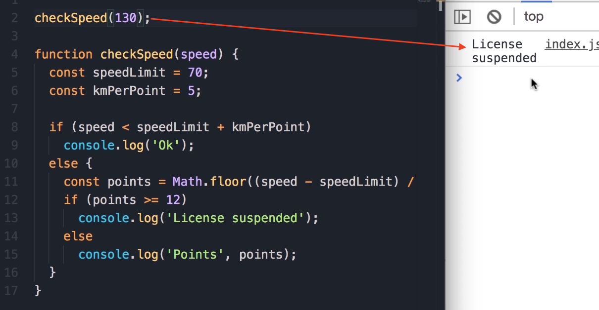
   
   - *"Beautiful. So our function is working."*

### Code Optimization: Removing the `else` Block

I just want to show you one more tip to make this code cleaner. Here, we have this `else` block, and this has caused indentation. This is not a terribly bad thing, but it's better to avoid indentation if we can (**otherwise we have to scroll left and right**).

If the first condition is true, we want to display "Ok" on the console, and then **return**. With `return`, we will jump out of this function, and none of the code after it will be executed.

With this, we can delete the `else` statement as well as the code block, and remove the indentation.

Final Cleaned Code

(This code reflects both bug fixes: it handles speeds up to 74 km/h as "Ok")

```javascript
checkSpeed(130); // Test call

function checkSpeed(speed) {
    const speedLimit = 70;
    const kmPerPoint = 5;

    // This condition now correctly handles the logic up to 75
    if (speed < speedLimit + kmPerPoint) {
        console.log('Ok');
        return;
    }
    // This code is now un-indented and will only run
    // if the 'if' block above is false (i.e., speed is 75 or more).
    const points = Math.floor((speed - speedLimit) / kmPerPoint);
    if (points >= 12)
        console.log('License Suspended');
    else
        console.log('Points', points);
}
```

---

## Exercise 5

**Write a function called `showNumbers` that takes a parameter called `limit`.**

When we call this function and pass a number (e.g., 10), it should display all the numbers from 0 up to (and including) the `limit`. Next to each number, it should specify if the number is "even" or "odd".

> **Student Pause Point:** It's a fairly easy exercise. Pause the video, spend a few minutes, and when you're done, come back and see the solution.

### Solution 1: Using `if/else`

1. First, we need a `for` loop. We set our `i` variable to 0.

2. As long as `i` is less than or equal to this `limit`, we are going to run this loop.

3. In every iteration, we'll increment `i`.

4. Inside the loop, we need to check if `i` is an even number or not.

5. So, if `i` modulous  2 (`i % 2`) equals 0, we display `console.log` of `i`, and as the second argument, we pass "even".

6. Otherwise, we do a `console.log` of `i` and "odd".

```javascript
function showNumbers(limit) {
  for (let i = 0; i <= limit; i++) {
    if (i % 2 === 0) {
      console.log(i, 'even');
    } else {
      console.log(i, 'odd');
    }
  }
}
```

### Solution 2: Code Optimization (Using Conditional Operator)

There is another way to write this program. Instead of having two separate `console.log` statements, we can do something like this:

1. We can declare a constant, call it `message`.

2. Here, we can use the **conditional operator**. So, if `i` is an even number (`i % 2 === 0`), we set `message` to "even"; otherwise, we set it to "odd".

3. Next, we do a *single* `console.log` of `i` and `message`.

```javascript
function showNumbers(limit) {
  for (let i = 0; i <= limit; i++) {
    const message = (i % 2 === 0) ? 'even' : 'odd';
    console.log(i, message);
  }
}
```

> **Key Takeaway:** I find this second implementation cleaner and less noisy, but if you used the first implementation, that's perfectly fine as well.

### Testing and Expected Output

Now, save the changes. If we call the function with `10`:

```javascript
showNumbers(10);
```

We get all the numbers from 0 to 10.

**Expected Output:**

```javascript
0 "even"
1 "odd"
2 "even"
3 "odd"
4 "even"
5 "odd"
6 "even"
7 "odd"
8 "even"
9 "odd"
10 "even"
```

---