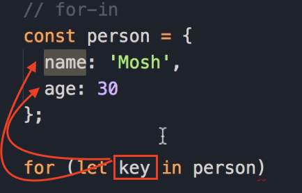
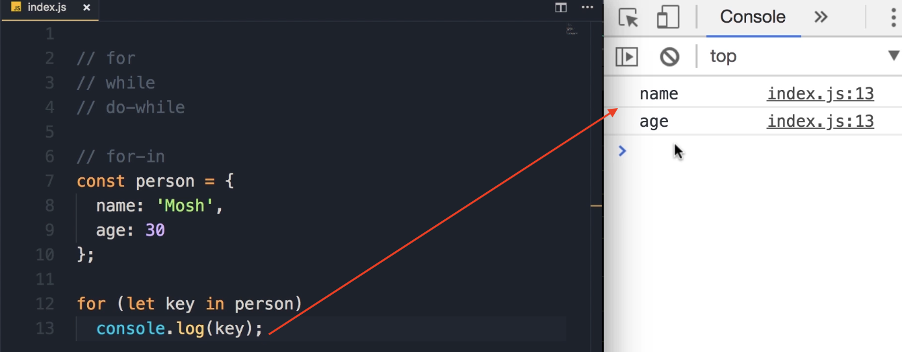
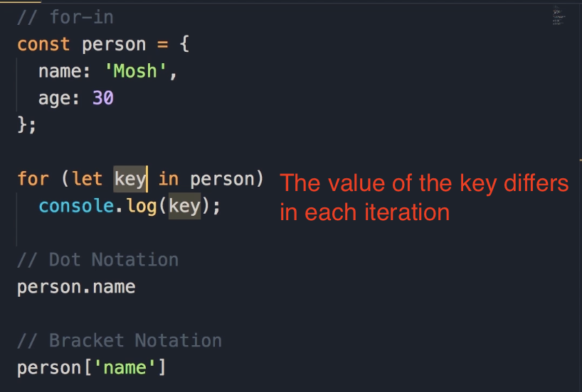
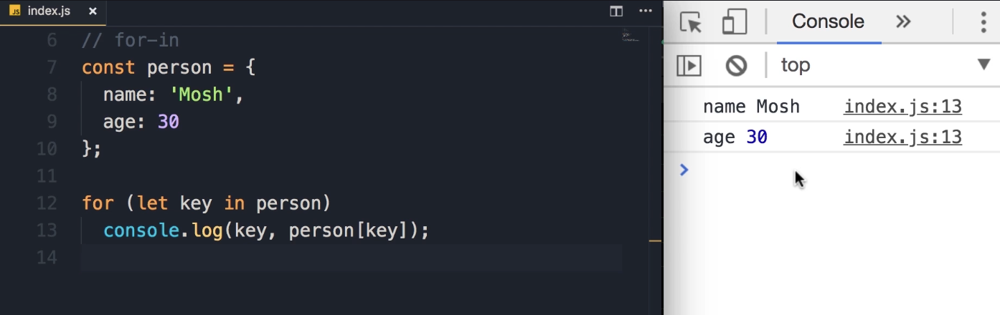
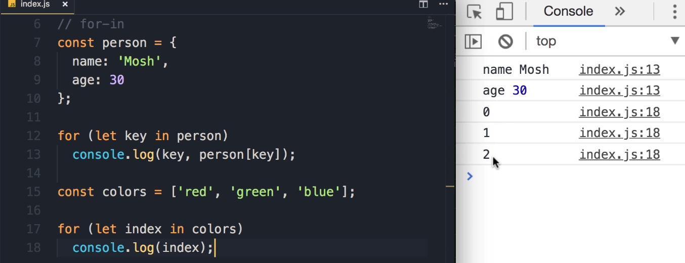
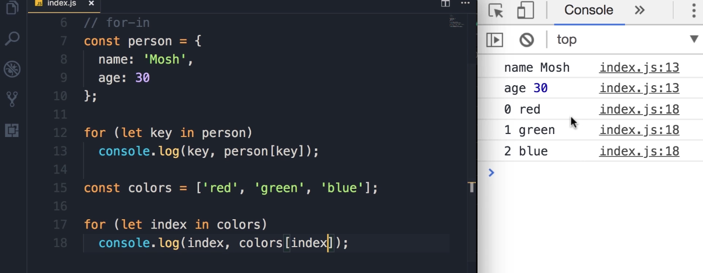

# For...in Loop

So far you have learned about three kinds of loops in JavaScript: 

1. `for` loops, 

2. `while` loops, and 

3. `do-while` loops. 

With all these loops, we can repeat an action a number of times.

But we have two more kinds of loops in JavaScript, and we use them to iterate over the **<u>properties of an object or elements in an array</u>**. 

Let me show you. In this lecture, we're going to look at the `for...in` loop.

### The `for...in` Loop for Objects

1. Let's say we have an **object** like `person`, with two properties: `name` ('Mosh') and `age` (30).
   
   ```javascript
   const person = {
    name: 'Mosh',
    age: 30
   };
   ```

2. Let's say we want to display all the properties of this `person` object. That's when we use the `for...in` loop.

3. So, `for`, and now in parentheses, unlike the `for` loop that we learned about earlier, we don't have three parts. We don't have that initial expression followed by a semicolon, the condition followed by the increment part. It looks a little bit different, let me show you.

4. We have `let key in person`. In every iteration, this `key` variable will hold one of the properties in this `person` object. Let me show you.
   
   

5. Here I'm going to do a simple `console.log` of `key`.
   
   ```javascript
   const person = {
    name: 'Mosh',
    age: 30
   };
   
   for (let key in person) {
    console.log(key);
   }
   ```

6. Save the changes.
   
   
   
   **Expected Output:**
   
   ```javascript
   name
   age
   ```
   
   So in the first iteration, `key` is `name`, and in the second iteration, it is `age`.

### Displaying Property Values

1. Now, what if you want to display the value of each property next to it?

2. Well, earlier you learned that there are two ways to access the properties of an object.
   
   - We can use the **dot notation**, which looks like this: `person.name`.
   
   - Or we can use the **bracket notation**: `person['name']`, passing the name of the target property as a **string**.

3. Earlier I told you that **we use the bracket notation when we don't know ahead of time, at the time of writing code, what property we're going to access**. Perhaps the name of the target property is calculated at runtime.

4. Here is a real example. When we iterate over the properties of the `person` object, in each iteration, the value of `key` is going to be different.
   
   

5. So, here we ***cannot* use the dot notation** to display the value of this property. In other words, we can't do something like this:
   
   ```javascript
   const person = {
       name: 'Mosh',
       age: 30
   };
   
   // This will not work
   for (let key in person)
     console.log(key, person.key);
   ```
   
   ...because we don't have a property called "key" in the `person` object.

6. So that's when we use the **bracket notation**. We add square brackets and pass `key` as the name of the target property.

7. Now let me delete this stuff here. Let's log the `key` and the value using bracket notation.
   
   ```javascript
   const person = {
    name: 'Mosh',
    age: 30
   };
   
   for (let key in person) {
    console.log(key, person[key]);
   }
   ```

8. Save the changes.
   
   
   
   **Expected Output:**
   
   ```javascript
   name Mosh
   age 30
   ```
   
   So you can see the value of `name` is Mosh and the value of `age` is 30.

**Key Takeaway:**

- This is the `for...in` loop, and we use it to iterate over the **properties of an object**.

### Using `for...in` with Arrays

1. We can also use these to iterate over an array. But it's not an ideal way; in the next lecture, I'm going to show you a better way. But let's see how that works before we finish this lecture.

2. I'm going to define an array called `colors` with three values: 'red', 'green', and 'blue'.
   
   ```javascript
   const colors = ['red', 'green', 'blue'];
   ```

3. Now we can use the `for...in` loop to iterate over this array.
   
   ```javascript
   for (let index in colors) {
   
   }
   ```

4. Note that I named this loop variable `index`, because in each iteration, this `index` variable will be set to the **index** of one of the elements in this array. So it's going to be 0, 1, and 2.

5. Let's take a look. So, `console.log(index)`.
   
   ```javascript
   const colors = ['red', 'green', 'blue'];
   
   for (let index in colors) {
    console.log(index);
   }
   ```

6. Save the changes.
   
   
   
   **Expected Output:**
   
   ```javascript
   0
   1
   2
   ```
   
   So, we get 0, 1, and 2.

7. Now, if **you want to get the element at a given index**, once again we use the square bracket notation. So, `colors[index]`.
   
   ```javascript
   const colors = ['red', 'green', 'blue'];
   
   for (let index in colors) {
    console.log(index, colors[index]);
   }
   ```

8. Save the changes.
   
   
   
   **Expected Output:**
   
   ```javascript
   0 red
   1 green
   2 blue
   ```
   
   And now we can see each element in our `colors` array.

### Preview: The `for...of` Loop

Now, starting from **ECMAScript 6 (or ES6)**, which is the modern version of JavaScript, we have a new kind of loop that is called the `for...of` loop, and that is an ideal way to iterate over arrays. That's what you're going to learn in the next lecture.
