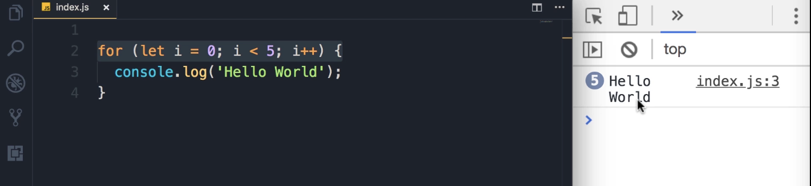
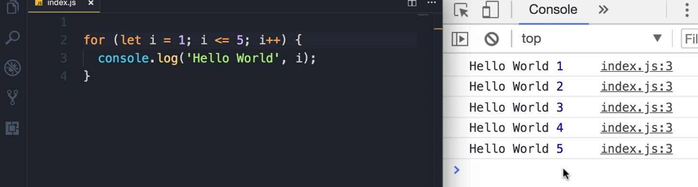

### For Loops

Sometimes we want to repeat an action a number of times. 

For example, let's imagine we want to display "**Hello World**" 5 times on the console. The poor way of doing that is like this:

```javascript
console.log('Hello World');
console.log('Hello World');
console.log('Hello World');
console.log('Hello World');
console.log('Hello World');
```

This code is ugly. There is a better way to achieve the same result, and that's where we use loops.

### Introduction to Loops

In JavaScript, we have various kinds of loops, and all these loops essentially do the same thing: they repeat an action a number of times.

We have:

- `for` loops

- `while` loops

- `do...while` loops

- `for...in` loops

- `for...of` loops

All these loops essentially do the same thing, but there is a subtle difference between how they start and end. Let's start by looking at the `for` loop.

### The `for` Loop

#### Syntax and Structure

This is how we write a `for` loop. We use `for`, we add parentheses, and here we need 3 statements.

`for ( [initialExpression]; [condition]; [incrementExpression] )`

1. **`initialExpression`**: The first statement is what we call `initialExpression`. Here we declare and initialize a variable.
   
   - We use `let` to declare a variable like `i` and set it to `0`.
   
   - `i` is short for "index" and is a common convention to use in `for` loops. This is what we call the loop variable.
   
   - We terminate this statement with a semi-colon (`;`).

2. **`condition`**: The second part of the `for` loop is what we call a `condition`.
   
   - Here we want to add a condition and compare the value of `i` with something else.
   
   - This loop will **<u>run *as long as* this condition evaluates to</u>** `true`.
   
   - If we want this loop to run 5 times, we compare `i` with 5 (e.g., `i < 5`). As long as `i` is less than 5, this loop will execute.
   
   - Once again, we terminate this statement with a semi-colon (`;`).

3. **`incrementExpression`**: The third part is what we call `incrementExpression`.
   
   - Quite often, what we have here is something like this: `i++`.
   
   - We use the increment operator to increment the value of `i` by 1 after each loop iteration.

After this `for` statement, we can add one or more statements. Just like `if` statements, if you have multiple statements here, you need to put them in a code block (`{ ... }`).

#### Example 1: Hello World 5 Times

Instead of repeating the line 5 times, we put it in a `for` loop.

1. **Code:**
   
   ```javascript
   for (let i = 0; i < 5; i++) {
    console.log('Hello World');
   }
   ```

2. Running the Code:
   
   Now, save the changes.
   
   

3. Output:
   
   We get 5 "Hello World" messages on the console.

#### Key Learning: How the `for` Loop Executes

Alright, now that you have seen a `for` loop in action, let's see exactly how this loop works.

1. The `initialExpression` (`let i = 0;`) runs **one time** at the beginning.

2. The `condition` (`i < 5`) is evaluated.
   
   - **If `true`:** The statements in the loop body are executed.
   
   - **If `false`:** The loop terminates.

3. After the loop body executes, the `incrementExpression` (`i++`) is executed.

4. The process repeats from **Step 2** (the condition is evaluated again).

### `for` Loop Examples

#### Example 2: Logging the Loop Variable (`i`)

To show you this in action, I'm going to output `i` on the console.

1. **Code:**
   
   ```javascript
   for (let i = 0; i < 5; i++) {
    console.log('Hello World', i);
   }
   ```

2. **Output**:
   
   This is what we get. Note that in the first iteration i is 0, then it's incremented by 1 until it reaches 4.
   
   ```
   Hello World 0
   Hello World 1
   Hello World 2
   Hello World 3
   Hello World 4
   ```

3. **Explanation**:
   
   At the end of the 5th iteration, `i` will be 4. When we increment that by 1, it will be 5. So, the **<u>condition (i < 5) will evaluate to false </u>**(because 5 is not less than 5), and the loop will stop.

#### Key Takeaway: Two Ways to Loop 5 Times

Essentially, there are two ways to repeat an action 5 times using the `for` loop.

- **Way 1:** Initialize `i` to `0` and check if it's **less than 5** (`i < 5`).

- **Way 2:** Initialize `i` to `1` and check if it's **less than or equal to 5** (`i <= 5`).

Let's look at the second way:

1. **Code:**
   
   ```javascript
   for (let i = 1; i <= 5; i++) {
    console.log('Hello World', i);
   }
   ```

2. **Output**:
   
   Now, if you save the changes, you can see i starts from 1 and finishes at 5.
   
   

#### Example 3: Displaying Odd Numbers

Now we can make this programming more interesting. Let's say we want to display the odd numbers between 1 to 5.

1. **Logic**:
   
   Instead of logging "Hello World," we can have an if statement and check the remainder of the division of i by 2 **(i % 2)**. If the remainder... is not 0 **(i % 2 !== 0)**, that means i is an odd number.

2. **Code:**
   
   ```javascript
   for (let i = 1; i <= 5; i++) {
    if (i % 2 !== 0) console.log(i);
   }
   ```

3. **Output**:
   
   Save the changes, so here are the odd numbers between one and five.
   
   ```
   1
   3
   5
   ```

#### Example 4: Looping in Reverse Order

There is also another way to write this loop. Instead of starting from 1 and going all the way to 5, we can start from **<u>5 and go back to 1</u>**.

1. **Logic**:
   
   We change the **initialExpression** (set **i to 5**), the condition (as long as i is greater than or equal to 1), and the incrementExpression (we want to **decrement i**).

2. **Code:**
   
   ```javascript
   for (let i = 5; i >= 1; i--) {
    if (i % 2 !== 0) console.log(i);
   }
   ```

3. **Output**:
   
   Save the changes. Now we get the odd numbers in the reverse order.
   
   ```
   5
   3
   1
   ```

It's more common to use the previous form (so we initialize `i` to 0 or 1 and increment it in every iteration). But in certain problems, you want to use the `for` loop in reverse order.
