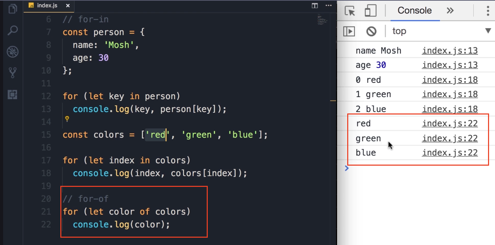

# For...of Loop

Starting from ECMAScript 6 (or ES6), we have a new way to **<u>iterate over arrays</u>**: the **`for...of` loop**. It's very similar to the `for...in` loop, but instead of the `in` keyword, we use the `of` keyword.

### Iterating an Array with `for...of`

1. Given our `colors` array:
   
   ```javascript
   const colors = ['red', 'green', 'blue'];
   ```

2. We can write a `for...of` loop to iterate over it.
   
   ```javascript
   for (let color of colors) {
    console.log(color);
   }
   ```
   
   

3. **Explanation:**
   
   - You can see with this new `for...of` loop, we don't have to deal with the index. We don't have to access the element at a given index (e.g., `colors[index]`).
   
   - In each iteration, the `color` variable (our loop variable) will hold one of the items in the array.

4. **Expected Output**:

   When this code is run (or "when I save the changes"), you see the items logged directly to the console:

```javascript
Output:
red
green
blue
```

### Key Takeaway: `for...in` vs. `for...of`

To summarize everything:

- We use the **`for...in`** loop to iterate over the **properties of an object**.

- We use the **`for...of`** loop to iterate over the **elements or items in an array**.
