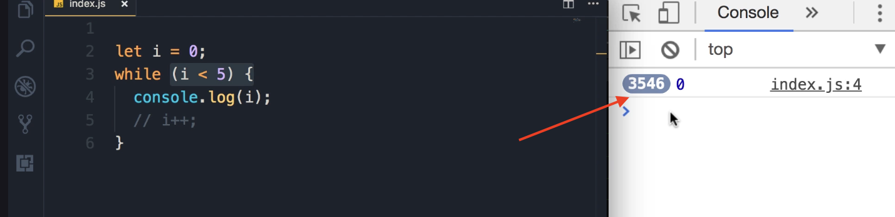
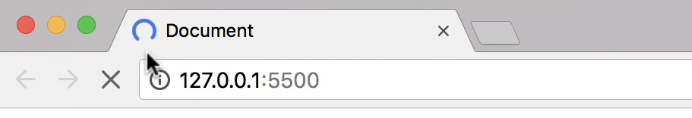
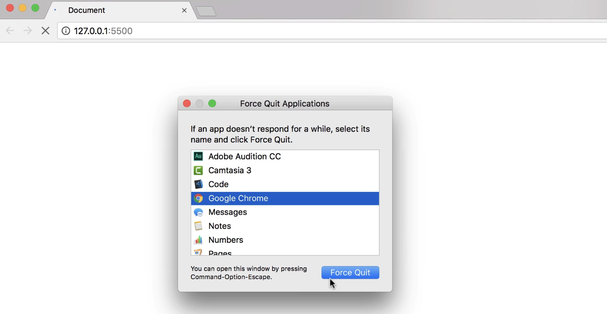

# Infinite Loops

When writing loops, something that you need to be aware of is what we call an "infinite loop." 

As the name implies, an **infinite loop executes infinitely or forever**. If you accidentally create one of these loops, you're going to <u>crash your browser or your computer</u>.

### Example of an Infinite `while` Loop

Let me show you an example.

1. Here, I'm going to declare a variable, set it to 0, and put it in a `while` loop.

2. The condition will be "as long as `i` is less than 5."

3. Inside the loop, we're going to do a `console.log` of `i`.

4. Now, technically, we should increment `i` here. But if you forget to do so, you end up creating an infinite loop.
   
   ```javascript
   let i = 0;
   while (i < 5) {
    console.log(i);
    // We forgot to increment i (i++;)
   }
   ```

5. **Why this is an infinite loop:**
   
   - In the first iteration, `i` is 0, and it's less than 5. So, we'll display `i` on the console.
   
   - Now, in the second iteration, `i` is *still* 0 and less than 5.
   
   - This loop will run forever.

#### Expected Output and Behavior

When I save the changes:

- **On the console:** This number you see before the "0" is the number of times you're displaying "0" on the console. You can see this number is increasing rapidly. So far, we have displayed "0" more than 3,500 times. 
  
  

- **In the browser:** If you look at the browser, you can see this spinner going forever. 
  
  

**Warning:** The only way to get rid of this is to close this window. Or, if this doesn't work, you'll have to force-quit Chrome. This is one example of an infinite loop.



### Other Examples of Infinite Loops

Infinite loops are not limited to `while` loops.

- **while (true)**:
  
  Here's another example. This loop is going to run forever.
  
  ```javascript
  while (true) {
    // Runs forever
  }
  ```

- **do-while loop**:
  
  We can create an infinite do-while loop.
  
  ```javascript
  do {
    // Runs forever
  } while (true);
  ```
  
  Or, similar to the first example, maybe we create a loop variable like 0 and then have a condition like `x < 5`, but we forget to increment `x` here.
  
  ```javascript
  let x = 0;
  do {
    // ...
    // We forgot to increment x
  } while (x < 5);
  
  ```

- **for loop**:
  
  We can also create an infinite for loop. Maybe we have the right condition, like i < 10, but we forget to add the third part. So, we don't increment i.
  
  ```javascript
  for (let i = 0; i < 10; ) {
    // We don't increment i
  }
  ```
  
  This is exactly like the `while` loop that we had earlier without incrementing `i`.
  
  OR:
  
  ```javascript
  for (let i = 0; i > 0; i++){
      console.log('Hello World');
  }
  ```

### Key Takeaway

Be aware of infinite loops. Avoid them, because they can crash your browser or your computer.
