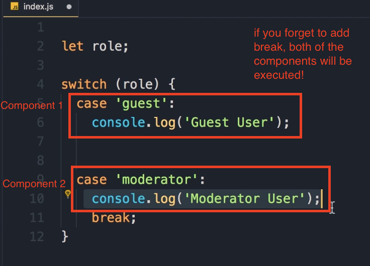

# Switch and Case Statements

Switch and case statements provide an alternative way to implement conditional logic in JavaScript, especially when you need to compare a **variable against multiple values**.

## Basic Switch Statement Structure

Let's start by declaring a variable called `role` that represents the role of the current user:

```javascript
let role; // This will be undefined initially
```

Now we want to check if the user is a guest, moderator, or admin. While we could use if-else statements, let's explore the switch and case approach.

### Step-by-Step Implementation

1. **Start with the switch statement**: We begin with the `switch` keyword, add parentheses, and instead of adding a condition, we add the variable we want to evaluate:

```javascript
switch (role) {
    // Case statements go here
}
```

2. **Add case statements**: Each case statement compares the value of the variable with something specific:

```javascript
switch (role) {
    case 'guest':
        console.log('Guest user');
        break;

    case 'moderator':
        console.log('Moderator user');
        break;

    default:
        console.log('Unknown role');
}
```

## Important: The Break Statement

**Critical Note**:

Consider the code below:



 You must add a `break` statement after each case. Without it, the execution will **"fall through"** to the next case statements, causing **multiple console.log statements** to execute <u>even when only one should match</u>.

For example, if you forget the break after the 'guest' case and the role equals 'guest', both the guest and moderator console.log statements would execute.

## Default Statement

The `default` statement is optional and executes when none of the cases match. You don't need a break statement for default because the control will automatically exit the switch block at that point.

## Testing the Switch Statement

Let's see how this works in practice:

See the code below:


**Initial Test** (role is undefined):

```javascript
let role; // undefined
// Output: Unknown role
```

**Testing with 'guest'**:

```javascript
let role = 'guest';
// Output: Guest user
```

**Testing with 'moderator'**:

```javascript
let role = 'moderator';
// Output: Moderator user
```

## Alternative Implementation with If-Else

Here's how you could implement the exact same logic using if-else statements:

```javascript
if (role === 'guest') console.log('Guest user');
else if (role === 'moderator') console.log('Moderator user');
else console.log('Unknown user');
```

**Note**: We're using strict equality (`===`) here, which checks both the **type** and **value** of the variable against what we have on the right side. (**right side**, means the output or the console of the browser)

## Key Takeaway: Switch vs If-Else Comparison

When comparing these two implementations, the if-else approach is **cleaner and shorter**. We don't have all the break statements, default keyword, or extra curly braces - these are considered extra noise in the code.

### When to Use Switch vs If-Else

- **Switch and case**: Can compare a variable against multiple values (strings, numbers, or even booleans, though booleans are less common)
- **If statements**: More appropriate for boolean comparisons (true/false)
- **Personal preference**: The instructor tends to use if-else more often, as switch statements are somewhat outdated and can look less clean

**Important Note**: There's nothing terribly wrong with switch statements - they can sometimes be more explicit. The choice often comes down to personal preference and coding style.

### Data Types in Switch Statements

Switch statements work with:

- Strings (most common, as shown in examples)
- Numbers
- Booleans (less common - if comparing **true/false**, `if ` statements usually make more sense to be used)
