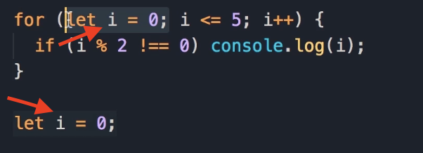
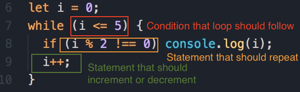

# JavaScript Loops: Implementing a `while` Loop

In the last lecture, we wrote a `for` loop to display all the odd numbers between 0 and 5. In this lecture, I'm going to show you how to implement the same logic by using a `while` loop.

### Key Learning: `for` Loop vs. `while` Loop

One key difference between a `while` loop and a `for` loop is that in `for` loops, the loop variable is part of the loop itself. But in `while` loops, you have to declare this variable externally. Let me show you what I mean.

### Translating a `for` Loop to a `while` Loop

Here is the `for` loop from the previous lesson that we want to translate:

```javascript
// Displays odd numbers between 0 and 5
for (let i = 0; i <= 5; i++) {
  if (i % 2 !== 0) {
    console.log(i);
  }
}
```

Output:

```javascript
1
3
5
```

Here is the step-by-step process to implement that same logic using a `while` loop.

**1. Declare the Loop Variable**

We start with declaring a variable like `i` and set it to 0.

```javascript
let i = 0;
```

> **A Note on Variable Scope**
> 
> Note that this `i` we have here is different from the `i` we have in the `for` loop, because that variable is only meaningful and accessible *inside* of that `for` loop. This is called **scope**, and I'm going to talk about it later in the course. 
> 
> All I want you to know is that **these two variables are completely different**, even though **their names are the same**.
> 
> 

**2. Add the `while` Statement and Condition**

Now, we have our loop variable initialized to 0. Next, we add a `while` statement. In parenthesis, we need to add our condition. What is the condition here? That is `i` less than or equal to 5.

```javascript
while (i <= 5) {
  // Statements go here
}
```

**3. Add the Statements to Repeat**

Next, we need to add our statements. What is the statement that we want to repeat? We want to display the odd numbers, so we add that here as well.

```javascript
while (i <= 5) {
  if (i % 2 !== 0) {
    console.log(i);
  }
}
```

**4. Increment the Loop Variable**

Finally, at the end of this `while` block, we need to increment `i`.

```javascript
while (i <= 5) {
  if (i % 2 !== 0) {
    console.log(i);
  }
  i++;
}
```

### Final Code and Execution Flow

So, this is a direct translation of the `for` loop into a `while` loop.

**Completed `while` Loop:**

```javascript
let i = 0;
while (i <= 5) {
  if (i % 2 !== 0) {
    console.log(i);
  }
  i++;
}
```

Output:

```javascript
1
3
5
```



This is what happens when we execute this code:

- Initially, `i` is 0.

- Now in the `while` loop, first this condition (`i <= 5`) is evaluated.

- If this condition is true, then the body of the `while` loop will be executed.

- Again, in the next iteration, the condition is evaluated again.

- If it's true, the statements in the `while` block will be executed.

- Otherwise, the `while` block will terminate.

In the next lecture, we're going to look at another kind of loop in JavaScript.
