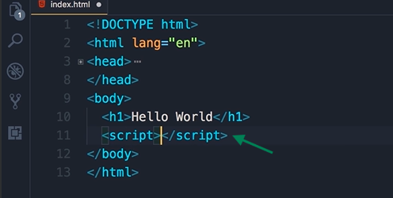
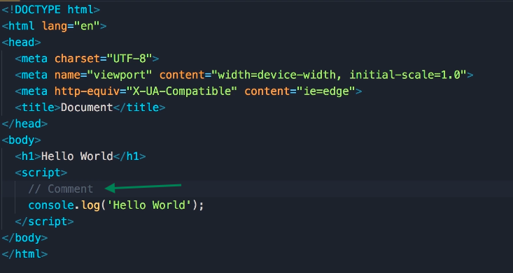
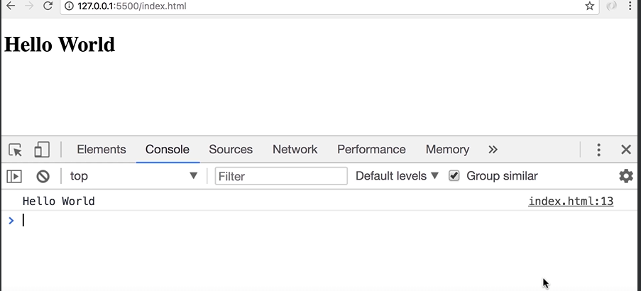

## JavaScript in Browsers

- Alright now we're ready to write our first JavaScript code. In order to write JavaScript code in `index.html`, we need a **script element**.

- There are two places, where we can add a script element:
  
  - in Head section or 
  
  - the body section

- The best practice is to put the script element at the end of the body section after **all the existing elements**.



- Now why did I say that as a best practice we should put the script element after existing elements, Well, there are two reasons for that:
  
  - First reason is that the browser parses this file from top to bottom, so if you put the script element here in the **head section**. You might have a lot of JavaScript code there, so your browser might get busy parsing and executing that JavaScript code, and it's one thing to be able to render the content of the page.
    
    - this will create a bad user experience
    
    - Your user looks at your web page it's white or blank, while your browser is busy parsing and executing your JavaScript code
  
  - The second reason is that almost always the code that we have in between script elements needs to talk to the elements on this web page. For example, we may want to show or hide some elements. So by adding the code here, at the end of the body section, we'll be confident that all these elements are rendered by the browser.

- Now there are exceptions to this rule, sometimes, you might need to include third-party scripts (e.g., analytics, advertisements, or specific libraries) that require being placed in the `<head>` section. These scripts might need to load before the rest of the page to function correctly or track the page load events.

- Now we are going to write the same code that we wrote in the last lecture, but in the `index.html` file. Here is how the code written:

```html
<!DOCTYPE html>
<html lang="en">
<head>
    <meta charset="UTF-8">
    <meta name="viewport" content="width=device-width, initial-scale=1.0">
    <title>Document</title>
</head>
<body>
    <h1>Hello World</h1>
    <script>
        // this is my first JavaScript code
        console.log('Hello World');
    </script>
</body>
</html>
```

- what we have here is a statement. 

> A statement is a piece of code that expresses an **action** to be carried out.
> 
> for example:
> 
> ```javascript
> console.log('Hello World'); /*This is a Statement*/
> ```

- In this case, we want to log a message on the console.

> All statements in Javascript should be terminated by a semi colon.

- What we have here in between single quotes, is called a string.


> A string is a sequence of characters

- Now in JavaScript we also have this notation, we can add two slashes, and this represents a comment.



- In the comments, we can add some description to our code and this description is ignored by the JavaScript engine, it's not executed. It's purely for documenting the code, when you want to explain to other developers why you have written this code this way. You don't want to explain what the code does, because that should be clear in itself.

- So for this demo, I'm just going to add a simple comment, `this is my first JavaScript code`.

- Now save the changes, go back in the browser, we need to bring the console back up:
  
  - Right-click somewhere, --> Click Inspect **OR** 
  
  - alternatively, you can use a shortcut, that is `alt` + `cmd` + `I`, on Mac, or `alt` +  `ctrl`+ `I` on Windows.

- That brings up the console tab, (click on the console tab if it is not visible to you...)


