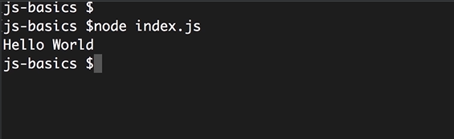
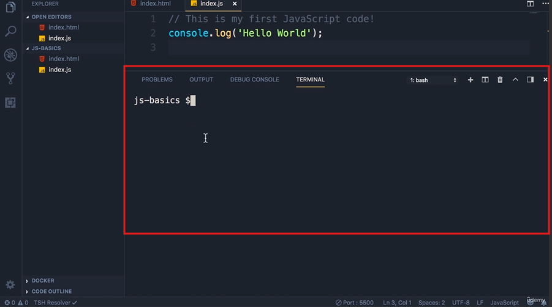

## JavaScript in the Node

- In the last lecture, we executed this piece of JavaScript code inside of a browser.

```js
// This is my first JavaScript code !
console.log('Hello World');
```

- In this lecture, I'm going to show you how to run the same code in Node.

- So I'm assuming you have installed Node on your machine, if not head over to [nodejs.org](https://nodejs.org/en) and download the latest version of Node.

- Now if you're on **Windows**, open up command prompt, if you're on **Mac**, open up terminal, and head over to the folder or directory that you have created earlier.

- In the terminal, run Node, and pass the name of our JavaScript file, that is index.js.



- We get the same message on the console.

- We can see that node is a program that includes google's v8 JavaScript engine.

- We can give it a piece of JavaScript code, and it will execute that code for us just like how we can execute some JavaScript code in a browser.

> Node is a run time environment for executing JavaScript code.

- Now let me show you a tip. Here in vs code we have an integrated terminal, so you don't have to explicitly open up a separate terminal window.

- So go to VS code, and open up the integrated terminal by pressing the shorcut keyboard key : `Cltrl` + `back quote` (which is for Windows)



- So we don't have to explicitly navigate to this folder. And here we can run Node
  
  index.js as well.
