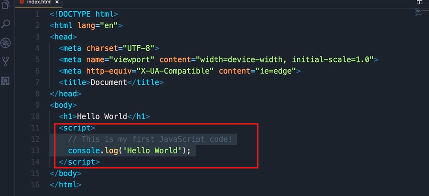
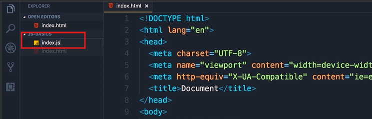
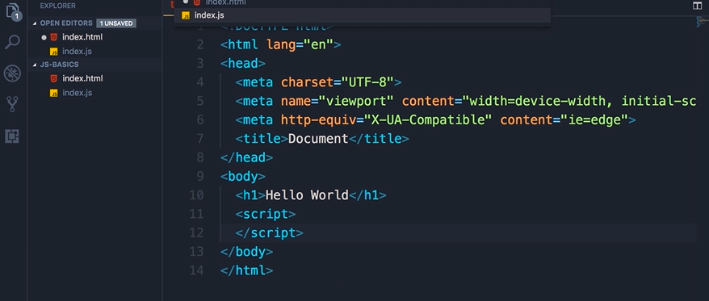
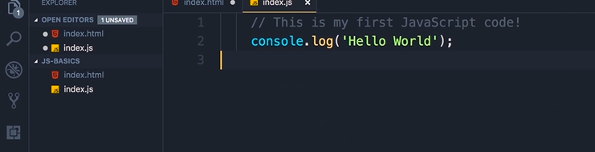
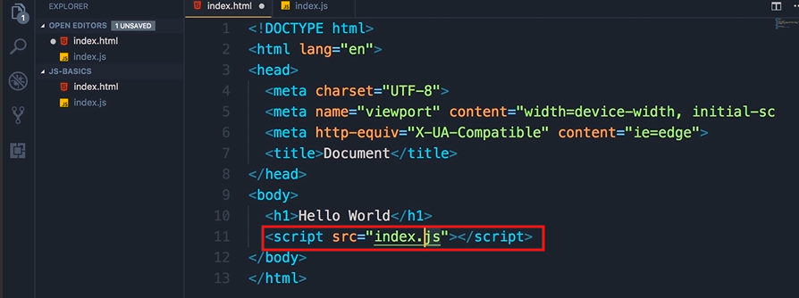

## Separation of Concerns

- Now while we can easily write JavaScript code in between the script element, in a real world application, you have 1000 maybe even a million lines of code, we don't want to write all that code in line here in `index.html` file.

- We want to extract and separate our JavaScript code from our html code.

- Let me give you a metaphor to understand this better
  
  - Think of your house. In your bedroom you have your bed, and your clothes
  
  
  
  - you don't store your clothes in the kitchen.
  
  - You will put your clothes in a closet separately. This is what we call **separation of concerns**

- You have the same principle in programming

- So we want to separate html (which is all about content), from JavaScript (which is all about behavior).

**What do you mean by behavior?**

- It means that:
  
  - How should your web page behave, what should happen when we hover our mouse over a given element?
  
  - Maybe something should pop up maybe something should be hidden,
  
  - so we use JavaScript to implement behavior.

**Practical Part**:

- So, open up the explorer window in VScode, and add the new file,

- call this new file as `index.js`.

- Now, back in index.html, cut all this JavaScript code below the  <**script**> tags and then paste it in index.js   (the highlighted part)

- Now in this simple application we have a single `index.html` file, a single JavaScript file `index.js`.

- In a real world application we have hundreds or even thousands of JavaScript files. Later in the course you will learn how to combine these files into a bundle, and serve that bundle into the client.

- Now, save the changes (`cltrl`+`S`), go back to `index.html` file. Since all our JavaScript code is in a separate file we need to reference that file here in `index.html`

- So, let's add an attribute here (see below pic), src, which is short for src, and set it to index.js.

- This tells the browsers that our JavaScript code is now in index.js

- Save the changes and run the live server. 

- We can still see the Hello World message in the console of the developer tools and that confirms that our code is still working.

In the next lecture, we're going to execute this code in Node.