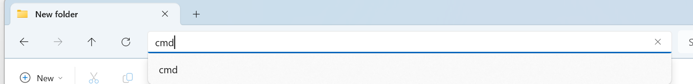
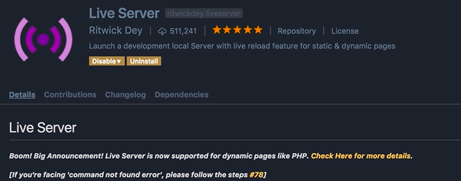
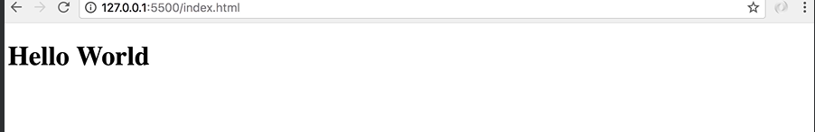

## Setting up the JavaScript Environment

Install the IDE which are required to run our javascript code files:

- [Visual Studio Code](https://code.visualstudio.com/)

- [Node.js](https://nodejs.org/en)

Once you have installed, the IDEs, follow this steps for the setup:

- Create a folder on Desktop

- go to searchbar of the file directory and type `cmd` 




- It will open up the command prompt, type in this command:

```bash
C:\Users\mehta\OneDrive\Desktop\New folder>code .
```

- this will open up the visual studio code IDE with the project folder

- Add a new file with `index.html` 

- Type the `!` and press `tab`, which will automatically generate **html boilerplate** code. (we don't really care about any of this code here, we're going to use this as a
  
  host for our JavaScript code.)

- Save the changes, now go to **Extensions** tab and search for **live server**.
  
  - So live server is a very light weight web server that we're going to use to serve our web application.
  
  

- When you are done, go to the explorer tab, right-click `index.html` and select
  
  open with live server.

- This will open up Chrome, or your default browser

**Rendering HTML on Browser**:

- Now currently we have an empty page, to make sure everything is working properly, let's go back to visual studio code

- Add this code in the body section of the html

```html
<body>
  <h1>Hello World</h1>
</body>
```

- Now save the changes, back in the browser, you can see this page is refreshed automatically and we've got the Hello World heading. With the live server we have live rendering of the code that we write.



In the next lecture, we're going to write your first JavaScript code.
