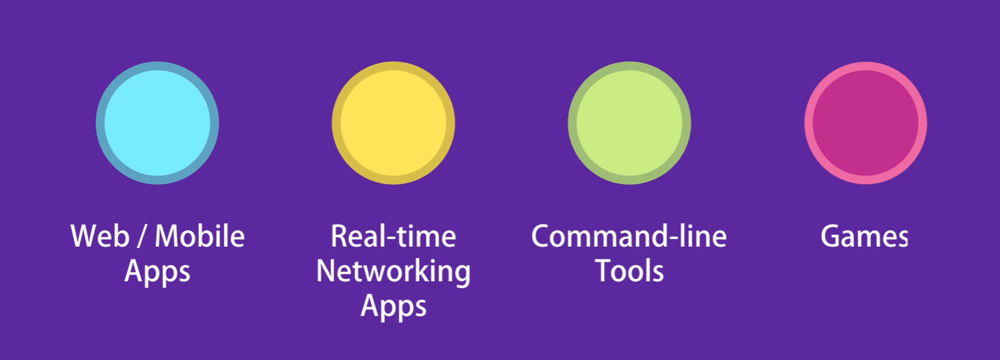
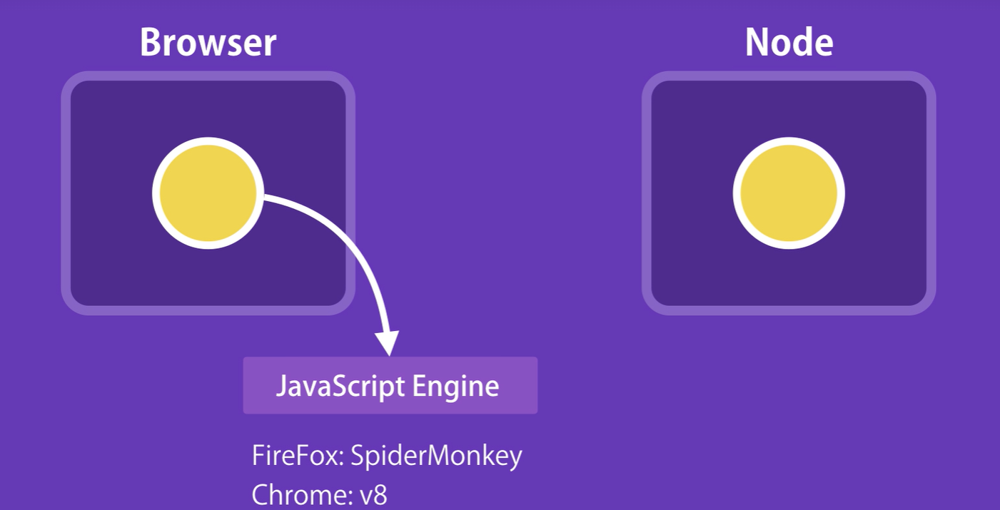
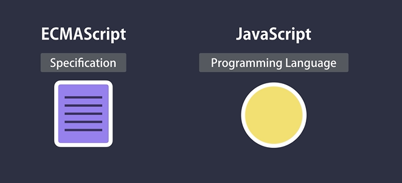
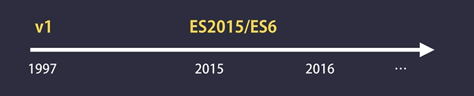
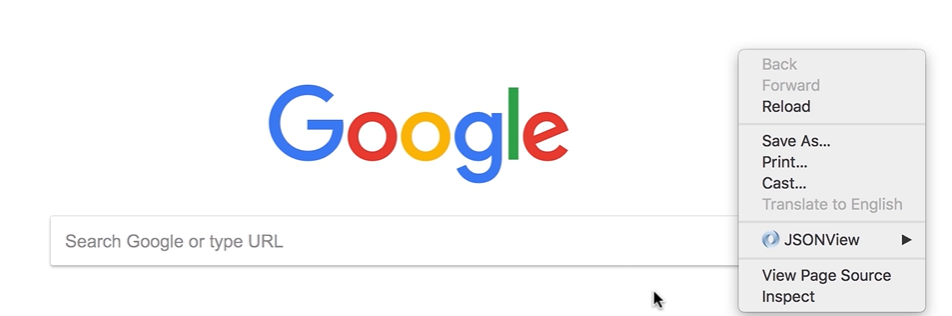
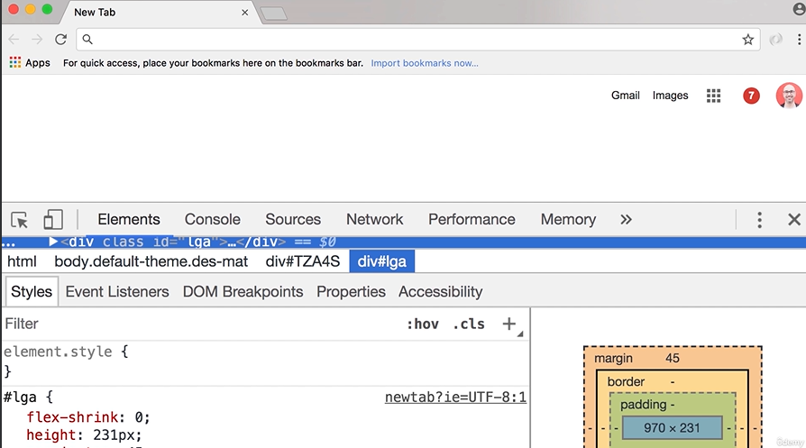
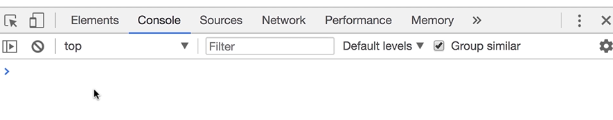
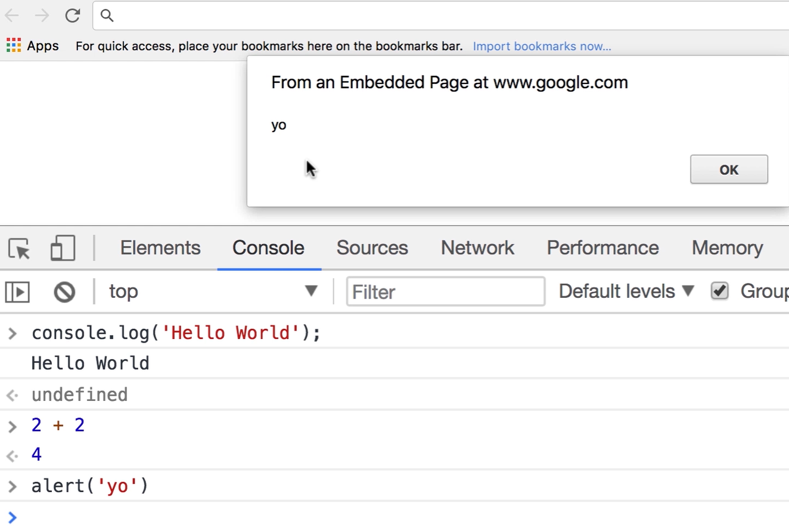

In this introduction, we are going to understand the four frequently asked questions about JavaScript:

1. What is JavaScript?

2. What can you do with it?

3. Where does JavaScript code run?

4. What is the difference between JavaScript and ECMAScript?


## **1. What is JavaScript?**

- JavaScript is one of the most popular and widely used programming languages in the world right now. It's growing faster than any other programming languages, and big companies like Netflix, Walmart, and PayPal, build entire applications around JavaScript.

- The average salary of a JavaScript developer, in the united states is $72,000 a year. It's a great opportunity to get a great job learning JavaScript.

- You can work as:
  
  - a front-end developer, or 
  
  - back-end developer, or 
  
  - a full-stack developer (who knows both front-end and back-end)

## **2. What can you do with JavaScript?**

- For a long time, JavaScript was only used in browsers to build interactive web pages. Some developers referred to Javascript as a toy language but those days are gone because of huge community support and investments like large companies like Facebook and Google.

- These days you can build full blown web or mobile apps as well as real-time networking apps like chats and video streaming services, command-line tools, or even games.



## **3. Where does JavaScript code run?**

- JavaScript was originally designed to run only in browsers. 

- So every browser has what we call a **JavaScript Engine** that can execute JavaScript code.

- For example, the JavaScript engines in Firefox and Chrome are SpiderMonkey and V8.


- In 2009, a very clever engineer called Brian Doll took the open source JavaScript engine in Chrome, and embedded it inside a C++ program. He called that program Node.

- So Node is a C++ program, that includes Google's V8 JavaScript engine. 

- Now with this we can run JavaScript code outside of a browser, so we can pass our JavaScript code to Node for execution.

- This means with JavaScript we can build the back-end for our web and mobile applications.



- In a nut shell,
  
  - JavaScript code can be run inside of a browser, or in Node.
  
  - Browsers and Node provide a runtime environment for our JavaScript code.

## **4. What is the difference between JavaScript and ECMA Script?**

- Well, ECMA Script is just a specification, JavaScript is a programming language that confirms to this specification.

- So, we have this organization called ECMA, which is responsible for defining standards, they take care of this ECMA Script specification.



- The first version of ECMA Script was released in 1997, then starting in 2015, ECMA
  
  has been working on annual releases of a new specification.

- In 2015, they released ECMA Script 2015 (which is also called ECMA Script version 6, or ES6 for short).



- This specification defined many new features for JavaScript.

---

Alright, enough theory, let's see JavaScript in action.

- So every browser has a JavaScript engine, and we can easily write JavaScript code here (in this here refers to the browser) without any additional tools.

- Of course, this is not how we build real world applications, but this is just for a quick demo for understanding purposes

## **Demo Part**:

- So open up Chrome browser, right click on an empty area of your browser and go to inspect.



- Now this opens up Chrome developer tools



- Here, select the console tab, this is our JavaScript console, and we can write any valid JavaScript code here.



- Type the javascript code:

```javascript
console.log('Hello World');
```

- So now, press enter, and you can see the `Hello World` message on the console.

- You can also write mathematical expressions here, For example 2+2 you get 4. Or
  
  we can do something likecreating **alert box** with message:

```js
alert('yo');
```



In the next lecture, I'm going to talk about setting up your development environment for writing JavaScript code.