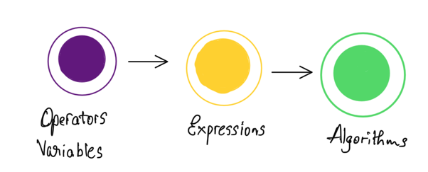

## 1. JavaScript Operators

Now that you have learned how to declare variables and constants, let's delve into operators.

In JavaScript, we have various types of operators. These are used alongside our variables and constants to create expressions. Through these expressions, we can implement logic and algorithms.

Here's an overview of the different kinds of operators in JavaScript:

- **Arithmetic Operators**
- **Assignment Operators**
- **Comparison Operators**
- **Logical Operators**
- **Bitwise Operators**

Over the next few lectures, we will explore each of these operators in detail.